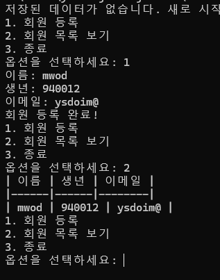
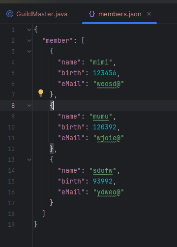

# 회원 관리 프로그램 구현
- 목표 :JSON 파일을 사용하여 회원 데이터를 관리하는 Java 콘솔 애플리케이션을 구현해본다
- 요구사항 :
  - 프로그램 시작 시 저장된 파일로부터 회원 데이터를 불러온다.
  - 다음 메뉴 중 하나를 선택할 수 있다.
    - 회원 등록
    - 회원 목록 보기
    - 종료
- 각 기능의 상세 설명은 다음과 같다
  - 회원 등록 기능
    - 사용자로부터 이름, 생년, 이메일을 입력받아 회원 목록에 추가한다.
    - 입력은 표준 입력을 사용하여 구현한다.
  - 회원 목록 보기 기능
    - 등록된 모든 회원의 이름, 생년, 이메일을 Mark Down의 표 형식으로 출력한다
  - 프로그램 종료 기능
    - 사용자가 프로그램 종료를 선택하면 모든 데이터를 저장하고 프로그램을 종료한다.
    - 회원 정보는 JSON 형식의 파일로 저장한다.
---


보내준 jar파일의 각 부분을 실행시켰을때는 이런느낌이다.

할 수 있는 부분부터 차례대로 구현해보기로 하자.

```java
public class GuildMaster{
    static Scanner sc = new Scanner(System.in);
    public static void main(String[] args) {
            회원정보를 불러오는 메서드
            System.out.println("1. 회원등록");
            System.out.println("2. 회원 목록 보기");
            System.out.println("3. 종료");
            System.out.println("옵션을 선택하세요");
            int choice = sc.nextInt();
            switch (choice) {
                case "1":
                    회원 등록 메서드;
                    break;
                case "2":
                    System.out.println("| 이름 | 생년 | 이메일 |");
                System.out.println("|------|------|--------|");
                회원 정보를 출력하는 메서드
                    break;
                case "3":
                    회원정보를 저장하는 메서드
                    break;
            }
        }
}
```

일단 보이는 부분을 구현하고 입력받을 Scanner를 하나 만들어준 뒤 switch-case문을 사용하여 입력받은 숫자마다 메서드를 구현해주려고했다.

첫번째는 회원등록하는 메서드 join을 구현해봤다.
```java
    public static void join() {
        System.out.println("이름을 입력하세요");
        String name = sc.nextLine();
        System.out.println("생년월일을 입력하세요");
        int birth = sc.nextInt;
        System.out.println("이메일을 입력하세요");
        String eMail = sc.nextLine();
        System.out.println("회원등록이 완료되었습니다.");
    }
```


??? 이름과 생일만 입력하고 나니까 이메일을 입력하지도 않았는데 회원등록을 완료해버린다.

다 구현하고 알게 된 사실인데 Scanner 메서드의 nextInt와 nextLine를 붙여쓰면 종종 일어나는 문제인데 우리가 nextInt로 생일을 입력한 후에 친 Enter가 컴퓨터가 입력받은대로 표현해보면 123355\n인데 여기서 nextInt가 123355까지만 인식하여 birth에 123355를 대입하고 eMail에 나머지 \n을 입력하여 바로 등록이 완료되어 버린것이다.  
해결법은 nextInt와 nextLine사이에 nextLine을 하나 더 집어넣어 \n을 입력받아 문제없게 만들어주거나 birth도 nextLine으로 받은뒤에 Integer.parseInt로 치환해주는 방법을 사용하면 이상없이 3가지 항목 모두 입력받을 수 있었다.

```java
    public static void join() {
        System.out.println("이름을 입력하세요");
        name = sc.nextLine();
        System.out.println("생년월일을 입력하세요");
        birth = Integer.parseInt(sc.nextLine());
        System.out.println("이메일을 입력하세요");
        eMail = sc.nextLine();
        System.out.println("회원등록이 완료되었습니다.");
    }
```
이런식으로 해주면 정상적으로 작동한다.

회원목록 보기를 구현하기 이전에 회원정보를 저장하는 메서드를 먼저 만들어줘야 할 것 같았다.  
그런데회원정보를 저장하려면 위에 3가지(이름,생일,이메일)을 입력받아 저장해줄 무언가가 필요할 것 같다.  
그래서 User라는 클래스를 하나 만들어주었다.
```java
class User {
    public User(String name, int birth, String eMail) {
        this.name = name;
        this.birth = birth;
        this.eMail = eMail;
    }
     public String toString() {
        return "| " + name + " | " + birth + " | " + eMail + " | ";
    }
}
```
이렇게 하면 3가지 정보를 User라는 하나의 틀로 묶을 수 있으며 저장하는 데 있어서 좀 더 원활해질거라고 생각했다.  
toString은 나중에 2번 회원목록 보기에 사용할 수 있을 것 같아서 미리 구현해두었다.  

파일을 저장하는 과정을 기존에 배웠던 FileInputStream/FileOutputStream을 사용하여 구현해보려고 했으나 해석불가능한 에러가 너무 많이 발생하여 다른 방법을 찾는 도중에 FileWriter와 Reader를 사용하는 방법을 보았고 해당 방법을 사용하는 인물은 List를 만들어 해당 정보를 관리하여 저장하는 시도를 해줬다.  
굉장히 좋은 방법이라고 생각해서 나도 UserList를 만들어서 입력받은 회원정보를 저장하고 관리할 수 있도록 하기로 했다.
```java
static List<User> member=new ArrayList<>();
```
그래서 맨 윗줄에 member라는 UserList를 하나 만들어줬다.  
근데 FileWriter나 Reader를 사용하기 위해서는 이List에 몇가지 기능을 구현할 필요성을 느꼈고 class를 하나 더 만들어주기로했다.
```java
class memberList {
    public List<User> member;

    public memberList(List<User> member) {
        this.member = member;
    }

    public List<User> getmemeberList() {
        return member;
    }
}
```
당장에 필요한건 이정도였고 구현된 부분을 토대로 FileWriter를 사용하여 회원정보를 저장하는 메서드를 만들어줄 것이다.
```java
public static void saveMember() {
    try (FileWriter fw = new FileWriter("members.json")) {
        Gson gson = new GsonBuilder().setPrettyPrinting().create();
        gson.toJson(new memberList(member), fw);
        System.out.println("회원 정보를 저장했습니다");
        System.out.println("프로그램을 종료합니다");
        } catch (IOException e) {
            e.printStackTrace();
        }
    }
```
선생님의 요구사항은 json파일로 저장하고 불러오는 것이었으므로 json파일로 저장한다. setPrettyPrinting() 이 녀석은 가독성을 높이기 위해 자동줄바꿈을 적용해주는 녀석이다.  
우리는 User형식으로 저장된 memberList를 FileWriter를 이용하여 'members.json'에 json파일형식으로 저장할것이다.  
우리는 List를 채용했으므로 회원등록하는 메서드에도 한줄 추가해줘야한다.
```java
    public static void join() {
        System.out.println("이름을 입력하세요");
        name = sc.nextLine();
        System.out.println("생년월일을 입력하세요");
        birth = Integer.parseInt(sc.nextLine());
        //sc.nextLine();를 넣어줘서 엔터를 정리or Int형식으로 형변환 사용
        System.out.println("이메일을 입력하세요");
        eMail = sc.nextLine();
        member.add(new User(name, birth, eMail));
        System.out.println("회원등록이 완료되었습니다.");
    }
```
가입부분은와 회원정보 저장부분은 구현이 끝났다.  
회원 목록을 보는 코드는 간단해서 메서드로 만들어줄 필요없이 그냥 case2번에 구현해주면 될거라 판단했고 그 다음 필요한것은 main문 시작시 저장햇던 members.json파일을 불러와줄 메서드가 필요하다.
```java
    public static void loadMember() {
        try (Reader reader = new FileReader("members.json")) {
            Gson gson = new Gson();
            member = gson.fromJson(reader, memberList.class).
            getmemeberList();
        } catch (IOException e) {
            e.printStackTrace();
        }
    }
```
InterliJ의 자동완성의 힘을 빌렸지만 일단 완성. 해당 메서드에 사용하기 위해 getmemeberList메서드를 memberList클래스에 만들어둔 것이다.  
해당 파일을 불러오면 만들어뒀던 member를 기존에 저장해뒀던 내용으로 덮어씌운다. 이제 이것들을 잘 배치만 해주면 과제를 무사히 마칠 수 있을 것 같다.


이때 생각난게 3번 종료를 제외하면 기능들이 실행되고 프로그램이 종료가 되는게 아니므로 다시 처음으로 돌아올 수 있게해야한다. main문을 다시 실행되게 만들어야하는데  
'main문은 짧을수록 좋다'는 선생님의 말에 따라 main문을 새로 만들고 기존의 main문은 mainMenu라는 메서드 형식으로 만들어주기로 했다.

```java
import com.google.gson.Gson;
import com.google.gson.GsonBuilder;

import java.io.*;
import java.util.ArrayList;
import java.util.List;
import java.util.Scanner;

public class GuildMaster {
    static Scanner sc = new Scanner(System.in);
    static List<User> member=new ArrayList<>();
    static String name, eMail;
    static int birth;

    public static void main(String[] args) {
        loadMember();
        mainMenu();
    }
public static void mainMenu() {
            System.out.println("1. 회원등록");
            System.out.println("2. 회원 목록 보기");
            System.out.println("3. 종료");
            System.out.println("옵션을 선택하세요");
            String choice = sc.nextLine();
            //int로 받았으나 회원정보 등록때와 만찬가지로 문제가 생길 수   
            //있어 문자열로 받게 수정
             switch (choice) {
            case "1":
                join();
                break;
            case "2":
                System.out.println("| 이름 | 생년 | 이메일 |");
                System.out.println("|------|------|--------|");
                for (int i = 0; i < member.size(); i++) {
                    System.out.println(member.get(i).toString());
                }
                mainMenu();
                break;
            case "3":
                saveMember();
                break;
        }
}
    public static void join() {
        System.out.println("이름을 입력하세요");
        name = sc.nextLine();
        System.out.println("생년월일을 입력하세요");
        birth = Integer.parseInt(sc.nextLine());
        System.out.println("이메일을 입력하세요");
        eMail = sc.nextLine();
        member.add(new User(name, birth, eMail));
        System.out.println("회원등록이 완료되었습니다.");
    }
    public static void loadMember() {
        try (Reader reader = new FileReader("members.json")) {
            Gson gson = new Gson();
            member = gson.fromJson(reader, memberList.class).getmemeberList();
        } catch (IOException e) {
            e.printStackTrace();
        }
    }
    public static void saveMember() {
        try (FileWriter fw = new FileWriter("members.json")) {
            Gson gson = new GsonBuilder().setPrettyPrinting().create();
            gson.toJson(new memberList(member), fw);
            System.out.println("회원 정보를 저장했습니다");
            System.out.println("프로그램을 종료합니다");
        } catch (IOException e) {
            e.printStackTrace();
        }
    }
}
```
선생님이 구현해서 보여준 jar파일과 동일한 기능을 갖춘 프로그램을 제작완료하였다.
  
입력받은 정보를 저장하고, 불러오는 것도 문제없었다.

---
---
# 피드백
지금 구현한 코드는 해당 메서드가 종료된 후 mainMenu를 다시 불러와 실행하는  
이른바 재귀형식을 띄고있다. 재귀형식을 사용하여 구현하면 스택오버플로우가 발생할 가능성도 있고 성능이 저하될 우려가 있다. 그래서 mainMenu를 계속 호출하는 방법을 배제하고 boolean과 while문을 사용하여 성능을 개선하였다.
```java
public static void mainMenu() {
        boolean quit= false;
        while(!quit){
            System.out.println("1. 회원등록");
            System.out.println("2. 회원 목록 보기");
            System.out.println("3. 종료");
            System.out.println("옵션을 선택하세요");
            String choice = sc.nextLine();
            switch (choice) {
                case "1":
                    join();
                    break;
                case "2":
                    System.out.println("| 이름 | 생년 | 이메일 |");
                System.out.println("|------|------|--------|");
                for (int i = 0; i < member.size(); i++) {
                    System.out.println(member.get(i).toString());
                }
                    break;
                case "3":
                    saveMember();
                    quit = true;
            }

        }
}
```
이런식으로 mainMenu 내부를 while로 감싸 '3번'종료를 실행했을때만 프로그램이 종료되도록 구현하면 main에서 mainMenu를 한번만 호출해도 동일한 기능을 가진 더 고성능의 코드가 될 수 있다.    

---
직렬화&역직렬화와 데이터 포맷 수업 후 받은 과제로 직렬화와 역직렬화 과정에서 약간의 문제가 있었으나 어찌저지 해결할 수 있는 수준의 과제였다.