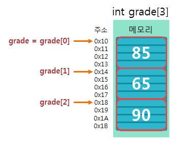
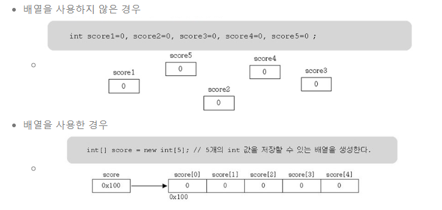
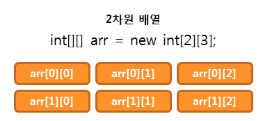
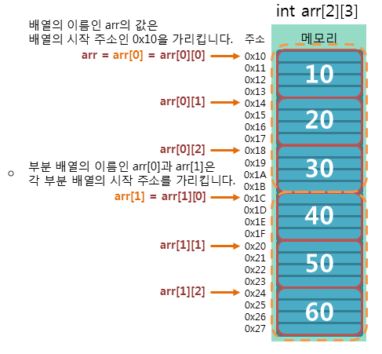

# 배열

- 고정된 크기의 동일한 데이터 유형 요소의 정렬된 컬렉션을 저장하는 프로그래밍의 데이터 구조
- 같은 타입의 여러 변수를 하나의 묶음으로 다룰 때 사용된다
- 많은 양의 값(데이터)를 다룰 때 유용하다
- <strong>배열의 각 요소는 서로 연속적이다</strong>



- 훨씬 효율적으로 데이터를 관리하는 것이 가능하다

## 배열의 선언
- 배열의 선언은 배열을 사용하기 위해 필요한 공간을 메모리에 할당하는 것을 의미한다
- 자바에서 배열을 선언하는 방법은 크게 두 가지가 있다. 타입 뒤에 대괄호를 사용하는 방법과 변수 이름 뒤에 대괄호를 사용하는 방법이다.
  - ex) 
    ```java
    int[] arr; or int arr[];
    ```

## 배열의 초기화
- 배열을 선언하고 나서는 배열을 사용하기 위해 필요한 공간을 메모리에 할당하는 것을 의미한다
각 배열의 요소는 자동으로 기본값으로 초기화된다
- 기본적으로 new 연산자를 사용하여 배열을 초기화한다
  ```java
  ex) int[] arr = new int[5];
  ```

- 자바는 여러 방법으로 배열을 선언하고 동시에 초기화할 수 있다
  ```java
  ex) int[] arr = new int[5];  
  ex) int[] arr = {1, 2, 3, 4, 5};
  ex) int[] arr = new int[]{1, 2, 3, 4, 5};
    ```

## 배열의 사용
- 배열의 각 요소에 접근하기 위해서는 인덱스를 사용한다
  - 인덱스는 0부터 시작한다
    ```java
    ex) arr[0], arr[1], arr[2], arr[3], arr[4]
    ```
- length 속성을 사용하여 배열의 크기를 알 수 있다
    ```java
    ex) arr.length
    ```

예제코드
```java
int[] myArray = {1, 2, 3, 4, 5};
int firstElement = myArray[0]; // 첫 번째 요소 접근
int thirdElement = myArray[2]; // 세 번째 요소 접근
int lastElement = myArray[4]; // 마지막 요소 접근
System.out.println("myArray 배열의 첫 번째 요소 : " + firstElement); // 1
System.out.println("myArray 배열의 세 번째 요소 : " + thirdElement); // 3
System.out.println("myArray 배열의 마지막 요소 : " + lastElement); // 5


int[] myArray = {1, 2, 3, 4, 5};
int arrayLength = myArray.length; // 배열의 길이를 구한다.
System.out.println("myArray 배열의 길이 : " + arrayLength); // 5
```

## 다차원 배열
- 2차원 이상으로 구현된 배열을 의미하며, 배열 요소로 또 다른 배열을 가지는 배열을 의미한다
  - 2차원 배열 : 배열 요소로 1차원 배열을 가지는 배열
  - 3차원 배열 : 배열 요소로 2차원 배열을 가지는 배열
  - 4차원 배열 : 배열 요소로 3차원 배열을 가지는 배열
  - …

### 2차원 배열의 사용


- 배열 요소로 1차원 배열을 가지는 배열
- 2차원 배열을 선언하고 초기화하는 방법은 1차원 배열과 동일하다
  - 타입[][] 배열이름 = new 타입[크기][크기];
  - ex) int[][] arr = new int[2][3];
- 2차원 배열도 여러 방법으로 선언하고 동시에 초기화할 수 있다
  - ex) int[][] arr = new int[2][3];
  - ex) int[][] arr = {{10, 20, 30}, {40, 50, 60}};
  - ex) int[][] arr = new int[][]{{10, 20, 30}, {40, 50, 60}};


예제코드
```java
int[][] arr = new int[2][3];

int k = 10;
for (int i = 0; i < arr.length; i++) {
    for (int j = 0; j < arr[i].length; j++) {
        arr[i][j] = k; // 인덱스를 이용한 초기화
        k += 10;
    }
}

for (int i = 0; i < arr.length; i++) {
    for (int j = 0; j < arr[i].length; j++) {
        System.out.print(arr[i][j] + " ");
    }
    System.out.println();
}
```
