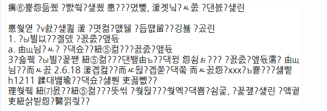
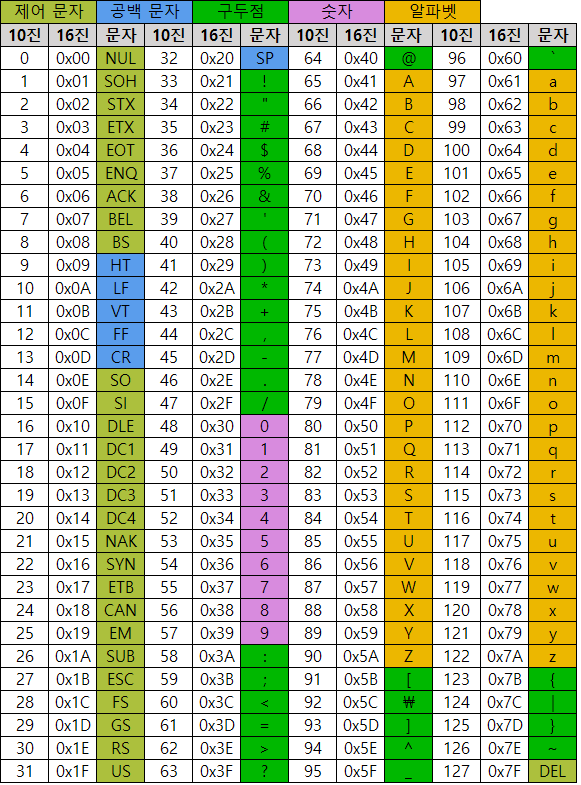
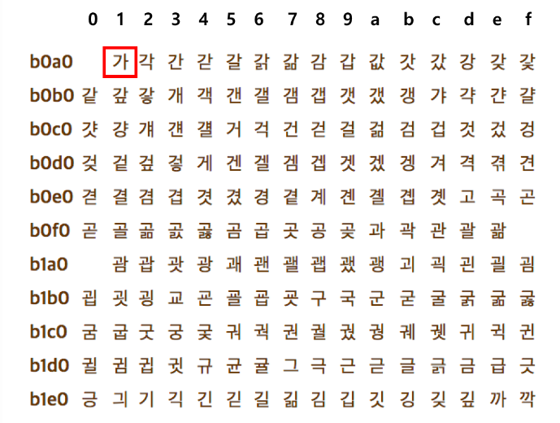
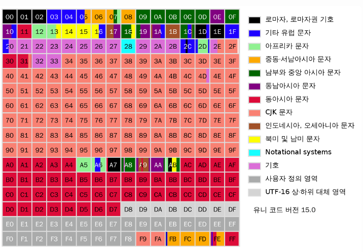
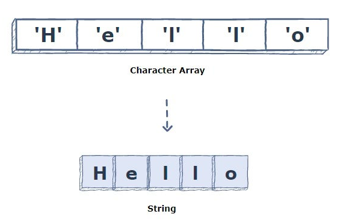
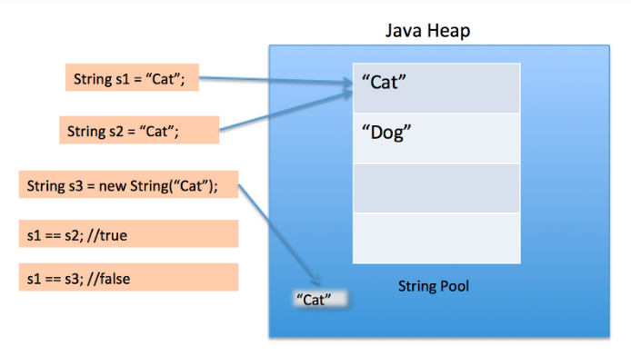

# 문자
- 컴퓨터는 2진수 숫자로 데이터를 저장하고 처리한다.
- 컴퓨터가 문자를 처리할 때는 다음과 같은 과정을 거친다.
  - 문자를 2진수 숫자로 변환한다.
  - 2진수 숫자를 메모리에 저장한다.
  - 메모리에 저장된 2진수 숫자를 다시 문자로 변환한다.
- 문자를 2진수 숫자로 변환하는 방법을 문자 인코딩 이라 하며, 여러가지 문자 인코딩 방식이 존재한다.
  - ASCII코드
  - EUC-KR
  - Unicode
  - ....



컴퓨터를 사용하다보면 이런 식으로 글자가 깨져서 원본을 알수 없는 문자들을 본 적이 있을 것이다.  
문자의 인코딩 형식이 맞지 않아 깨져서 출력되는 것이다.  
  - 일본어 환경에 맞춰서 작성된 문서나 프로그램을 한국어 환경에서 실행하려고 하면 글자가 깨져보이는 현상 등

## ASCII

- ASCII(American Standard Code for Information Interchange)는 미국정보교환표준부호로, 7비트(128개)로 표현된다.
- ASCII 코드는 0부터 127까지의 숫자를 각각 하나의 문자 또는 기호에 대응시켜 놓은 것이다.
- ASCII의 경우 영어만을 표현할 수 있기 때문에, ASCII만으로는 다른 언어를 표현할 수 없다.  
  이를 해결하기 위해 다양한 문자 인코딩 방식이 등장하였다. 대표적으로 EUC-KR, Unicode 등이 있다.

JAVA에서는 아스키코드를 이용하여 아래와 같이 출력할 수 있다.
```java
char ch = 'A';
int num = ch;
System.out.println(num); // 65
```

### 자바에서의 특수문자 표현
- 자바에서는 특수문자를 표현하기 위해 \를 사용한다
- \\를 사용하여 특수문자를 표현할 수 있다
- \\n : 줄바꿈
- \r : 캐리지 리턴 (커서를 가장 앞으로 이동)
- \t : 탭
- \\' : 작은 따옴표
- \\" : 큰 따옴표
- \\\ : 역슬래시

```java
System.out.println("Hello\nWorld"); // Hello
                                    // World
System.out.println("Hello\rWorld"); // World
System.out.println("Hello\tWorld"); // Hello   World
System.out.println("Hello\'World"); // Hello'World
System.out.println("Hello\"World"); // Hello"World
System.out.println("Hello\\World"); // Hello\World
```
※ 줄바꿈 문자는 운영체제마다 다르니 유의할 것!
- Windows : \r \n
- Unix 계열 (리눅스, macOS) : \n

이 때문에 macOS에서 작성한 파일을 Windows에서 열면 줄바꿈이 제대로 되지 않는다.

자바에서는 \n을 사용하면 운영체제에 맞게 자동으로 변환하여 줄바꿈을 처리한다.


## EUC-KR (Extended Unix Code-Korea)



- ASCII가 영어밖에 지원을 하지 않았기 때문에, 나라마다 문자 인코딩 방식을 만들어서 사용하였다.
- EUC-KR은 한글을 표현하기 위해 만들어진 문자 인코딩 방식이다.
  - 완성형 인코딩 방식이다.
- EUC-KR은 2바이트로 표현된다.
  - 약 2만자 정도 표현할 수 있다.

 EUC-KR의 경우 한글, 특수기호, 영어, 한문, 일어 등 다양한 언어를 지원하지만, 모든 언어를 지원하지는 않는다. 예를 들어 EUC-KR로 한글 + 태국어 같은 조합을 표현할 수 없다.

 ## Unicode


- 유니코드(Unicode)는 전 세계의 모든 문자를 컴퓨터에서 일관되게 표현하고 다룰 수 있도록 설계된 산업 표준이다.
- 유니코드는 가변 길이 문자 인코딩 방식이다.
  - 1바이트에서 4바이트까지의 가변 길이 문자 인코딩 방식이다.
  - 약 100만자 정도 표현할 수 있다.
- 인코딩 방식으로는 UTF-8, UTF-16, UTF-32 이 있다.

### UTF-16
- 가변 길이 인코딩 방식.
- Unicode의 초기 버전에서 사용되었던 인코딩 방식.
- 문자에 따라 2byte, 4byte 까지 다양한 크기로 인코딩된다.
  - 원래 16비트만을 사용하여 유니코드 문자를 표현하도록 설계되었으나, 유니코드의 확장으로 인해 16비트로 표현할 수 없는 문자들이 생겨나면서 표현 범위가 4바이트까지 확장되었다.
- Java와 .NET 같은 여러 프로그래밍 환경에서 사용된다.

### UTF-8
- 가변 길이 인코딩 방식.
- 문자에 따라 1byte ~ 4byte 까지 다양한 크기로 인코딩된다.
- UTF-16 등장 이후 ASCII와의 호환성을 유지하면서 유니코드를 표현할 수 있도록 설계되었다.
  - ASCII 범위 내의 문자는 1바이트로 표현된다.
  - ASCII 범위를 벗어나는 문자는 2바이트 이상으로 표현된다.
- 가장 널리 사용되는 유니코드 인코딩 방식 중 하나이며, 웹에서 특히 흔하게 사용된다.

### UTF-32
- 고정 길이 인코딩 방식.
- 모든 문자를 4byte로 표현한다.
- 모든 문자에 대해 고정된 길이의 인코딩을 제공하여 인덱싱을 용이하게 하기 위한 용도로 사용된다.
- UTF-32으로 인코딩 할 경우 추가적인 계산이 필요하지 않기 때문에, UTF-16, UTF-8에 비해 빠르다.
  - 다만, 메모리를 많이 사용한다.

※유니코드는 한가지 방식만 주용하는 것이 아닌 필요에 따라 골라 사용한다.

# 문자열


- 문자열은 문자의 나열이며, 문자의 배열이라 볼 수 있다.
  - 예를 들어 char[] str = {'H', 'e', 'l', 'l', 'o'};라고 선언하면, str은 char형의 배열로 구현되어 있으며, str[0]은 H, str[1]은 e, str[2]는 l, str[3]은 l, str[4]는 o를 가리킨다.
- 자바에서 문자열은 String 클래스의 객체로 구현된다.
- 자바는 String Constant Pool이라는 메모리 영역에 고유한 문자열 리터럴을 저장하여 관리하여 메모리를 효율적으로 사용한다.

```java
char[] str = {'H', 'e', 'l', 'l', 'o'};
for (int i = 0; i < str.length; i++) {
    System.out.print(str[i]); // Hello
}
System.out.println();

System.out.println(str); // Hello (자동으로 문자열로 변환되어 출력된다)
```


## 문자열 합성

문자열 합성은 + 연산자를 사용하여 이루어진다.
```java
String str = "Hello";
String str2 = "World";
String str3 = str + str2;
System.out.println(str3); // HelloWorld
```

Q : 앞선 내용에서 문자열은 문자의 배열(char[])이라 볼 수 있다고 했는데, 그렇다면 문자열 합성은 어떻게 이루어질까?

A : 문자열 합성 시 크기를 늘리고, 기존 문자열을 복사한 후, 새로운 문자열을 추가한다.
```java
char[] str = {'H', 'e', 'l', 'l', 'o'};
char[] str2 = {'W', 'o', 'r', 'l', 'd'};
char[] str3 = new char[str.length + str2.length];
for (int i = 0; i < str.length; i++) {
    str3[i] = str[i];
}
for (int i = 0; i < str2.length; i++) {
    str3[str.length + i] = str2[i];
}
System.out.println(str3); // HelloWorld
```
따라서 문자열 합성은 많은 연산을 필요로 하기 때문에, 자주 사용하는 경우 성능이 저하될 수 있다. 또한 메모리를 많이 사용하므로, 메모리 사용량이 증가할 수 있다. 따라서 문자열 합성은 자주 사용하지 않는 것이 좋다.  
빈번하게 사용해야 한다면 자바에서 문자열 합성 시 효율적으로 처리할 수 있도록 StringBuilder 클래스를 제공하므로 이걸 사용하자.

## 문자열을 == 로 비교하면 안되는 이유

- 문자열은 String 클래스의 객체로 구현되어 있으며 참조 변수이다. 참조변수는 ==로 비교하면 안되며, equals()로 비교해야 한다.
- equals()는 두 문자열의 내용이 같은지를 비교한다.
- 만약 ==로 비교하면 예측하지 못한 결과가 발생할 수 있다.
- true가 나올 수도 있고, false가 나올 수도 있다.
  
```java
char[] str = {'H', 'e', 'l', 'l', 'o'};
char[] str2 = {'H', 'e', 'l', 'l', 'o'};
System.out.println(str == str2); // False

String str = new String("Hello");
String str2 = new String( "Hello");
System.out.println(str == str2); // False

String str = "Hello";
String str2 = "Hello";
System.out.println(str == str2); // True일 수도 False일 수도 있다. 이를 이해하기 위해선 `String Constant Pool`을 이해해야 한다.
```
직접적인 값을 가지고 있느냐, 해당 값을 가르키는 변수냐의 차이로 T가 나올수도 F가 나올 수도 있다.

## String Constant Pool
- 중복 문자열을 최소화하여 메모리 사용량을 줄이는 목적으로 만들어졌다.
- 문자열 리터럴(" ")을 사용하여 String 객체를 생성하면, 자바는 먼저 String Constant Pool에서 해당 문자열이 이미 존재하는지 확인하고 문자열이 이미 존재한다면, 새로운 객체를 생성하지 않고 기존 객체에 대한 참조를 반환한다.
  - 즉 String Constant Pool에 이미 존재하는 문자열이라면, 새로운 객체를 생성하지 않고 기존 객체에 대한 참조를 반환한다


```java
// 자바에서 메모리를 효율적으로 관리하며, 이미 저장된 문자열과 동일한 값을 가진 새로운 문자열이 생성되면, 새로 메모리를 할당하지 않고 기존 문자열의 참조를 반환한다
String str = "Hello";
String str2 = "Hello";

System.out.println("str:" + str);
System.out.println("str2:" + str2);

System.out.println(str == str2); // True일 수도 False일 수도 있다.
System.out.println(str.equals(str2)); // 항상 True


// 문자열을 명시적으로 새로운 String 객체를 생성하고, 힙 메모리에 할당시킨다.
String str = new String("Hello");
String str2 = new String( "Hello");

System.out.println("str:" + str);
System.out.println("str2:" + str2);

System.out.println(str == str2); // 항상 False
System.out.println(str.equals(str2)); // 항상 True
```

### String 클래스
- 자바에서 문자열은 String 클래스의 객체로 구현된다.
- String 클래스는 문자열을 다루기 위한 다양한 메소드를 제공한다.

### String 이 제공하는 유용한 메서드
|메서드|설명|
|:---|:----|
|charAt(int index)|	문자열에서 해당 위치에 있는 문자를 반환한다|
|concat(String str)|	문자열을 합성한다|
|contains(CharSequence s)|	문자열이 특정 문자열을 포함하는지 확인한다|
|equals(Object obj)|	문자열이 같은지 확인한다|
|equalsIgnoreCase(String str)|	문자열이 같은지 대소문자를 구분하지 않고 확인한다|
|indexOf(String str)|	문자열에서 특정 문자열이 처음으로 등장하는 위치를 반환한다|
|lastIndexOf(String str)|	문자열에서 특정 문자열이 마지막으로 등장하는 위치를 반환한다|
|length()|	문자열의 길이를 반환한다|
|replace(CharSequence target, CharSequence replacement)|	문자열에서 특정 문자열을 찾아 다른 문자열로 변경한다|
|split(String regex)|	문자열을 특정 문자열을 기준으로 나눈다|
|startsWith(String prefix)|	문자열이 특정 문자열로 시작하는지 확인한다|
|substring(int beginIndex)|	문자열에서 특정 위치부터 끝까지 추출한다|
|substring(int beginIndex, int endIndex)|	문자열에서 특정 위치부터 특정 위치까지 추출한다|
|toLowerCase()|	문자열을 소문자로 변환한다|
|toUpperCase()|	문자열을 대문자로 변환한다|
|trim()|	문자열 앞뒤의 공백을 제거한다|

#### 메서드 예시
- charAt(int index) : 문자열에서 해당 위치에 있는 문자를 반환한다
```java
String str = "Hello";
char ch0 = str.charAt(0);
System.out.println(ch0); // H
char ch1 = str.charAt(1);
System.out.println(ch1); // e
char ch2 = str.charAt(2);
System.out.println(ch2); // l
char ch3 = str.charAt(3);
System.out.println(ch3); // l
char ch4 = str.charAt(4);
System.out.println(ch4); // o
```

- concat(String str) : 문자열을 합성한다
```java
String str = "Hello";
String str2 = "World";
System.out.println(str.concat(str2)); // HelloWorld
```
- contains(CharSequence s) : 문자열이 특정 문자열을 포함하는지 확인한다

```java
String str = "Hello";
System.out.println(str.contains("el")); // True
System.out.println(str.contains("ll")); // True
System.out.println(str.contains("lll")); // False
```
- equals(Object obj) : 문자열이 같은지 확인한다

```java
String str = "Hello";
String str2 = "Hello";
String str3 = new String("Hello");
System.out.println(str.equals(str2)); // True
System.out.println(str.equals(str3)); // True
```

- equalsIgnoreCase(String str) : 문자열이 같은지 대소문자를 구분하지 않고 확인한다

```java
String str = "Hello";
String str2 = "hello";
System.out.println(str.equalsIgnoreCase(str2)); // True
```

- IndexOf(String str) : 문자열에서 특정 문자열이 처음으로 등장하는 위치를 반환한다

```java
String str = "Hello";
System.out.println(str.indexOf("l")); // 2
System.out.println(str.indexOf("ll")); // 2
System.out.println(str.indexOf("lll")); // -1
```

- lastIndexOf(String str) : 문자열에서 특정 문자열이 마지막으로 등장하는 위치를 반환한다

```java
String str = "Hello";
System.out.println(str.lastIndexOf("l")); // 3
System.out.println(str.lastIndexOf("ll")); // 2
System.out.println(str.lastIndexOf("lll")); // -1
```
- length() :문자열의 길이를 반환한다
  
```java
String str = "Hello";
System.out.println(str.length()); // 5
```

- replace(CharSequence target, CharSequence replacement) : 문자열에서 특정 문자열을 찾아 다른 문자열로 변경한다

```java
String str = "Hello";
System.out.println(str.replace("l", "L")); // HeLLo
```

- split(String regex) : 문자열을 특정 문자열을 기준으로 나눈다

```java
String str = "Hello World";
String[] arr = str.split("(regex)");
for (int i = 0; i < arr.length; i++) {
    System.out.println(arr[i]);
}
// Hello
// World
```
※ regex는 필요할 때 검색해서 찾아서 사용하도록하자. 현실적으로 다 외우기 힘듦.

- startsWith(String prefix) : 문자열이 특정 문자열로 시작하는지 확인한다

```java
String str = "Hello";
System.out.println(str.startsWith("He")); // True
System.out.println(str.startsWith("Hee")); // False
```

- substring(int beginIndex) : 문자열에서 특정 위치부터 끝까지 추출한다

```java
String str = "Hello";
System.out.println(str.substring(0)); // Hello
System.out.println(str.substring(1)); // ello
System.out.println(str.substring(2)); // llo
System.out.println(str.substring(3)); // lo
System.out.println(str.substring(4)); // o
```

- substring(int beginIndex, int endIndex) : 문자열에서 특정 위치부터 특정 위치까지 추출한다

```java
String str = "Hello";
System.out.println(str.substring(0, 1)); // H
System.out.println(str.substring(0, 2)); // He
System.out.println(str.substring(0, 3)); // Hel
System.out.println(str.substring(0, 4)); // Hell
System.out.println(str.substring(0, 5)); // Hello
System.out.println(str.substring(1, 2)); // e
System.out.println(str.substring(1, 3)); // el
System.out.println(str.substring(1, 4)); // ell
// ...
```

- toLowerCase() : 문자열을 소문자로 변환한다
```java
String str = "Hello";
System.out.println(str.toLowerCase()); // hello
```

- toUpperCase() : 문자열을 대문자로 변환한다
```java
String str = "Hello";
System.out.println(str.toUpperCase()); // HELLO
```

- trim() : 문자열 앞뒤의 공백을 제거한다
```java
String str = "         Hello World        ";
System.out.println(str.trim()); // Hello World
```