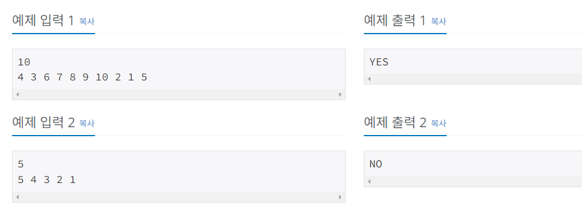
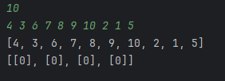
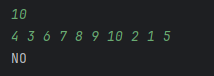
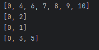
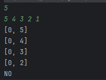
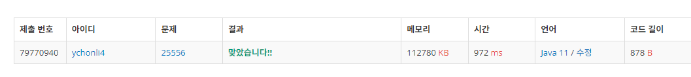

24.06.17
# 25556번 포스택

- 포닉스는 길이가 $N$인 순열 $A$와 네 개의 비어 있는 스택을 가지고 있다.
  - 길이가 $N$인 순열이란, $1$ 이상 $N$ 이하의 서로 다른 정수 $N$개가 임의로 나열된 수열을 말한다.
  - 스택이란 자료구조의 한 종류로 가장 나중에 삽입한 자료가 가장 먼저 나오는 후입선출 (Last In First Out, LIFO)의 특성을 가지고 있다.  
  
포닉스는 PPC를 맞아 더러워진 순열을 청소하려 한다.

순열을 청소하는 것은 다음과 같은 과정을 통해 순열을 오름차순으로 정렬하는 것을 뜻한다. 즉 순열을 
$1, 2, 3, \cdots N$으로 만들어야 한다.

1. 순열 $A$의 원소들을 앞 원소부터 순서대로 네 개의 스택 중 하나에 삽입한다.
2. 순열 $A$의 모든 원소를 스택에 삽입했다면, 네 개 중 원하는 스택에서 수를 꺼내는 것을 반복하여 네 개의 스택에서 모든 수를 꺼낸다.
3. 꺼낸 수들을 꺼낸 순서대로 오른쪽에서 왼쪽으로 나열한다. 즉, 가장 처음에 꺼낸 수가 맨 뒤, 가장 나중에 꺼낸 수가 맨 앞에 위치하게 된다.
   
포닉스가 주어진 순열을 청소할 수 있는지 판별해 보자.

## 입력
- 첫째 줄에 순열의 길이 
$N$이 주어진다. 
$(1 ≤ N ≤ 100\,000)$ 

- 둘째 줄에 순열 
$A$의 원소 
$A_i$가 공백으로 구분되어 주어진다. 모든 
$A_i$는 
$1$ 이상 
$N$ 이하의 서로 다른 정수임이 보장된다

## 출력
포닉스가 순열을 청소할 수 있으면 YES, 불가능하다면 NO를 출력한다.



## 풀이
언제나처럼 위에서부터 천천히 구현한다.
```java
 public static void main(String[] args) {
    Scanner sc = new Scanner(System.in);
    int N = sc.nextInt();
    int[] A = new int[N];
    for (int i = 0; i < N; i++) {
        A[i]=sc.nextInt();
    }
    System.out.println(Arrays.toString(A));
```
  

- 입력받은대로 제대로 저장되고 출력된다.  
- 4개짜리 Stack에 원소를 삽입하고, 다 삽입하면 꺼내고, 꺼낸 순서대로 오른쪽에서 왼쪽으로 나열한다.
- 즉 앞,뒤롤 바꿔서 오름차순으로 정렬되게 저장하는 것이다.

```java
        Stack<Integer>[] fonix = new Stack[4];
        for (int i = 0; i < fonix.length; i++) {
            fonix[i]=new Stack<>();
            fonix[i].push(0);
        }
```
fonix라는 4개짜리 스택을 만들어 각 스택을 null에서 0으로 초기화시켜주었다.  
 

이제 이 fonix에 A에 있던 정보를 집어넣고 빼며 오름차순으로 정렬되는지 확인할 수 있도록 구현하자.
```java
for (int i : A) { //배열만큼 반복
            for (int j = 0; j < fonix.length; j++) {
                if(i>fonix[j].peek()){ 
                    fonix[j].push(i);
                    break;
                }
                if(i<fonix[j].peek()) {
                    System.out.println("NO");
                    return;
                }
            }
        }
        System.out.println("YES");
```
i가 fonix[j]보다 크면 해당 스택에 i를 계속 집어넣고 그게 아니면 다음 스택에 저장하는 방식으로 이게 전부 된다면 yes를 도중에 스택에 저장이 불가능하다면 no를 출력하도록 만들었다.  
   
??? 예제1번을 입력했는데 NO가 나온다.  
디버그 해보니 두번째 반복중에 3이 4보다 작아서 스택이 남아있음에도  바로 NO가 출력되고 종료되어 버리는것.  
그 다음 스택으로 넘어가서 저장할 수 있도록 두번째 if문에서 새로운 조건을 추가해줘야한다.
```java
if(j==3&&i<fonix[j].peek()
```
이렇게 바꿔주었다.  
  

최종적으로 입력한 숫자는 4개의 스택에 저장되며 이것을 pop하는 것으로 오름차순을 만들 수 있게된다.  
즉 청소가 가능하다.



반대로 5,4,3,2,1은 5,4,3,2는 4개의 스택에 들어갈 수 있으나 1이 그 어떤 스택에도 들어갈 수가 없다.   
즉 청소가 불가능하여 NO가 출력된다.


```java
최종코드
import java.util.Scanner;
import java.util.Stack;

public class notepad2 {
    public static void main(String[] args) {
        Scanner sc = new Scanner(System.in);
        int N = sc.nextInt();
        int[] A = new int[N];
        for (int i = 0; i < N; i++) {
            A[i]=sc.nextInt();
        }
        Stack<Integer>[] fonix = new Stack[4];
        for (int i = 0; i < fonix.length; i++) {
            fonix[i]=new Stack<>();
            fonix[i].push(0);
        }
        for (int i : A) {
            for (int j = 0; j < fonix.length; j++) {
                if(i>fonix[j].peek()){
                    fonix[j].push(i);
                    break;
                }
                if(j==3&&i<=fonix[j].peek()) {
                    System.out.println("NO");
                    return;
                }
            }
        }
        System.out.println("YES");
    }
}
```