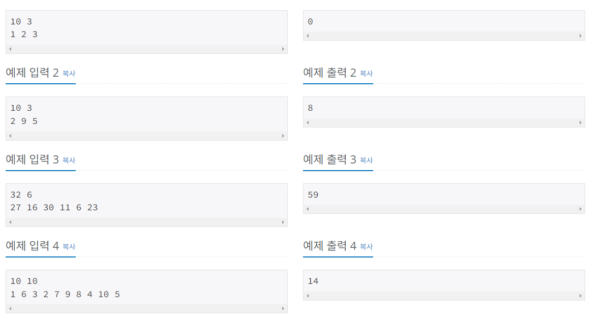
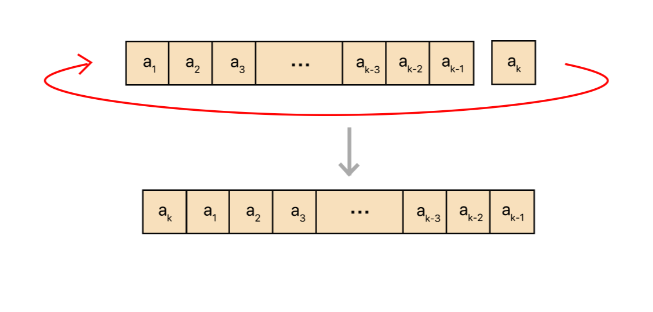
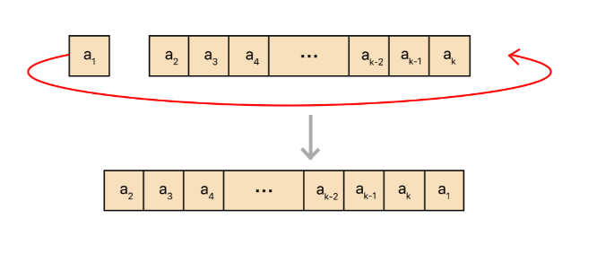
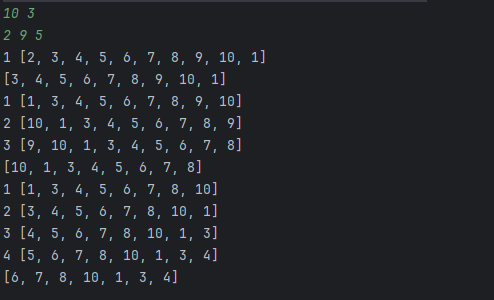
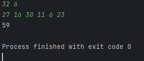
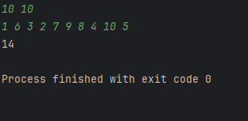
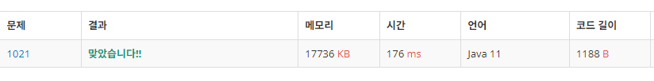

24.06.18
# 1021번 회전하는 큐
## 문제
지민이는 N개의 원소를 포함하고 있는 양방향 순환 큐를 가지고 있다. 지민이는 이 큐에서 몇 개의 원소를 뽑아내려고 한다.

지민이는 이 큐에서 다음과 같은 3가지 연산을 수행할 수 있다.

1. 첫 번째 원소를 뽑아낸다. 이 연산을 수행하면, 원래 큐의 원소가 a1, ..., ak이었던 것이 a2, ..., ak와 같이 된다.
2. 왼쪽으로 한 칸 이동시킨다. 이 연산을 수행하면, a1, ..., ak가 a2, ..., ak, a1이 된다.
3. 오른쪽으로 한 칸 이동시킨다. 이 연산을 수행하면, a1, ..., ak가 ak, a1, ..., ak-1이 된다.
   
큐에 처음에 포함되어 있던 수 N이 주어진다. 그리고 지민이가 뽑아내려고 하는 원소의 위치가 주어진다.  
 (이 위치는 가장 처음 큐에서의 위치이다.)  
  이때, 그 원소를 주어진 순서대로 뽑아내는데 드는 2번, 3번 연산의 최솟값을 출력하는 프로그램을 작성하시오.

  ## 입력
  - 첫째 줄에 큐의 크기 N과 뽑아내려고 하는 수의 개수 M이 주어진다. 
  - N은 50보다 작거나 같은 자연수이고, M은 N보다 작거나 같은 자연수이다.
  - 둘째 줄에는 지민이가 뽑아내려고 하는 수의 위치가 순서대로 주어진다.
  - 위치는 1보다 크거나 같고, N보다 작거나 같은 자연수이다.

## 출력
- 첫째 줄에 문제의 정답을 출력한다(연산의 최솟값).



## 풀이

- 세가지의 연산을 필요로 한다.  
    1. 큐에서 첫번째 원소를 뽑아내는 것(Poll)
    2. 큐의 제일 앞에 있는 원소를 제일 마지막으로 보내는 것.
    3. 큐의 마지막에서 제일 앞으로 원소를 보내는 것.

- 이중에서 2,3번을 보면 처음이나 마지막에서 원소를 떼서(Poll) 그 반대편에 덧붙이는(add) 형식이다.


- 그렇다. 앞에서도 poll과 add, 뒤에서도 poll과 add가 일어난다.
  - 큐는 큐지만 양끝에서 요소의 삽입, 삭제가 가능한 <strong>디큐(Deque)</strong> 되시겠다.

해당 정보를 토대로 코드를 작성해보자
```java
    public static void main(String[] args) {
        Scanner sc = new Scanner(System.in);
        LinkedList<Integer> deque = new LinkedList<>();
        int N = sc.nextInt(); // 0<N<=50
        int M = sc.nextInt(); // M<=N
        for (int i = 1; i <= N ; i++) {
                deque.add(i); //큐에 1부터 입력받은 N까지의 숫자를 전부 넣어준다
            }
        int[] addNum = new int[M]; // 뽑아내려는 숫자를 저장하는 배열
        for (int i = 0; i < M; i++) {
            addNum[i]=sc.nextInt();
        }
```
- deque라는 리스트를 하나 만들어주고 입력에 명시된 것들을 구현한다.
  - 큐의 각 위치에는 번호에 맞는 원소를 넣어주는거다.
    - deque(i)=i가 되도록
```java
 for (int i = 0; i < M; i++) {//찾으려는 갯수M만큼 반복한다.
            int target = deque.indexOf(addNum[i]);
            int halfQue = deque.size() / 2;
```
- indexof는 리스트에서()안에 있는 값의 존재여부와 위치를 알수 있다.
  - addNum의 i번째 원소를 찾은 목표변수(target)에 대입한다.
- halfQue는 해당 큐의 중간값을 찾아 넣어준다.
  - 중간값을 기준으로 왼쪽으로 도는게 더 빠른지 오른쪽으로 도는게 더 빠른지 확인할 수 있게 만들어줄거다. 그래야 최소값이 될테니까.  
  
```java
 if(target<=halfQue){
    for (int j = 0; j < target; j++) {
        int temp = deque.pollFirst();
        deque.addLast(temp);
    } else {
    for (int j = 0; j < deque.size()-target; j++) {
        int temp = deque.pollLast();
        deque.addFirst(temp);
        }
    }
    deque.pollFirst();
```
- 목표한 원소가 중간값보다 작다면 target 원소가 나올때까지 앞에서 원소를 떼어(pollFirst) temp값에 저장하고 이것을 큐의 마지막 부분에 추가해준다(deque.addLast(temp)).
-  이렇게 2번, 3번 연산을 반복하여 target이 큐의 첫번째 값에 위치하게되면 이것을 제거한다(pollFirst).
```java
Scanner sc = new Scanner(System.in);
        LinkedList<Integer> deque = new LinkedList<>();
        int N = sc.nextInt(); // 0<N<=50
        int M = sc.nextInt(); // M<=N
        for (int i = 1; i <= N ; i++) {
            deque.add(i);
        }
        int[] addNum = new int[M];
        for (int i = 0; i < M; i++) {
            addNum[i]=sc.nextInt();
        }

        for (int i = 0; i < M; i++) {
            int target = deque.indexOf(addNum[i]);
            int halfQue = deque.size() / 2;

            if(target<=halfQue){
                for (int j = 0; j < target; j++) {
                    int temp = deque.pollFirst();
                    deque.addLast(temp);
                    System.out.println(j+" "+ deque);
                }
            } else {
                for (int j = 0; j < deque.size()-target; j++) {
                    int temp = deque.pollLast();
                    deque.addFirst(temp);
                    System.out.println(j+" "+ deque);
                }
            }
            deque.pollFirst();
            System.out.println(deque);
        }
```
중간중간에 deque를 출력하도록 하여 정상적으로 연산이 이루어지는지 확인해보겠다.

### 예제 1번


타겟이 항상 제일 앞에 위치하기 때문에 2,3번 연산이 발생하지 않고 pollFirst만 발생하였다.

### 예제 2번


- 1이 왼쪽으로 한칸 이동한 후에 목표였던 target 2가 제거되었다(연산 1번)
- 9가 제일 앞으로 올때까지 오른쪽으로 원소 이동이 발생하여 target이 제거되었다(연산 3번)
- 5가 제일 앞으로 올때까지 왼쪽으로 회전하여 target을 제거하였다(연산 4번).

예제출력처럼 총 8번의 연산이 발생하였다.  
이제 println 대신 연산횟수를 저장할 변수를 추가하여 코드를 완성한다.

```java
import java.util.LinkedList;
import java.util.Scanner;

public class notepad2 {
    public static void main(String[] args) {
        Scanner sc = new Scanner(System.in);
        LinkedList<Integer> deque = new LinkedList<>();
        int N = sc.nextInt(); // 0<N<=50
        int M = sc.nextInt(); // M<=N
        int ccc = 0;
        for (int i = 1; i <= N ; i++) {
            deque.add(i);
        }
        int[] addNum = new int[M];
        for (int i = 0; i < M; i++) {
            addNum[i]=sc.nextInt();
        }

        for (int i = 0; i < M; i++) {
            int target = deque.indexOf(addNum[i]);
            int halfQue = deque.size() / 2;

            if(target<=halfQue){
                for (int j = 0; j < target; j++) {
                    int temp = deque.pollFirst();
                    deque.addLast(temp);
                    
                    ccc++;
                }
            } else {
                for (int j = 0; j < deque.size()-target; j++) {
                    int temp = deque.pollLast();
                    deque.addFirst(temp);
                    ccc++;
                }
            }
            deque.pollFirst();
        }
        System.out.println(ccc);
    }
}
```

  

예제 3번, 4번도 정상적으로 출력된다.

  