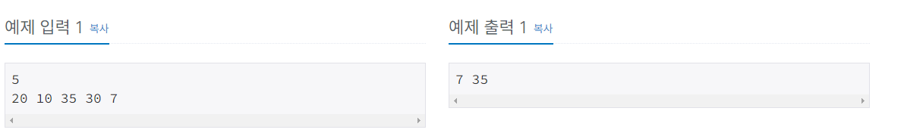
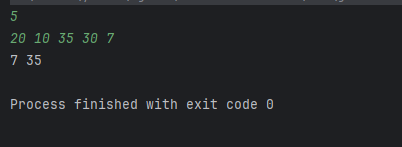
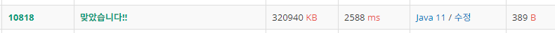
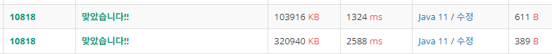

# 10818번 최소, 최대
## 문제
N개의 정수가 주어진다. 이때, 최솟값과 최댓값을 구하는 프로그램을 작성하시오.
## 입력
첫째 줄에 정수의 개수 N (1 ≤ N ≤ 1,000,000)이 주어진다. 둘째 줄에는 N개의 정수를 공백으로 구분해서 주어진다. 모든 정수는 -1,000,000보다 크거나 같고, 1,000,000보다 작거나 같은 정수이다.
## 출력
첫째 줄에 주어진 정수 N개의 최솟값과 최댓값을 공백으로 구분해 출력한다



## 풀이

그냥 개수, 정수 입력받아서 정렬하고 첫번째값이랑 마지막 값만 출력하면 되지 않을까?
```java
import java.util.Arrays;
import java.util.Scanner;

public class notepad2 {
    public static void main(String[] args) {
        Scanner sc = new Scanner(System.in);
        int N = sc.nextInt();
        int[] arr = new int[N];
        for (int i = 0; i < N; i++) {
            arr[i] = sc.nextInt();
        }
        Arrays.sort(arr);
        System.out.println(arr[0]+" "+arr[N-1]);
    }
}
```
  


되네...?  
근데 너무 메모리를 많이 잡아먹는다.
버퍼리더와 스트링토큰을 사용하여 코드를 수정한다.
```java
import java.io.*;
import java.util.Arrays;
import java.util.StringTokenizer;


public class notepad2 {
    public static void main(String[] args) throws IOException {
        BufferedReader br = new BufferedReader(new InputStreamReader(System.in));
        int N = Integer.parseInt(br.readLine());
        StringTokenizer st = new StringTokenizer(br.readLine()," ");
        int[] arr = new int[N];
        int i =0;
        while (st.hasMoreTokens()){
            arr[i]=Integer.parseInt(st.nextToken());
            i++;
        }
        Arrays.sort(arr);
        System.out.println(arr[0]+" "+arr[N-1]);
    }
}
```

  
메모리가 압도적으로 줄어들었다.