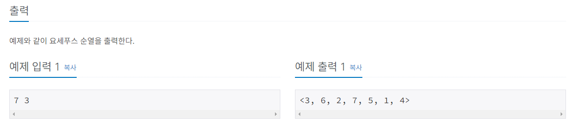
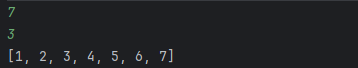
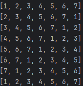
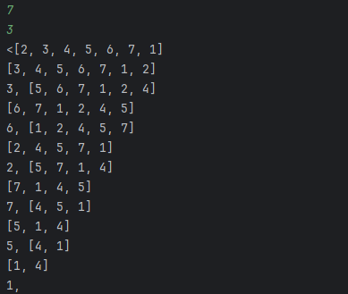
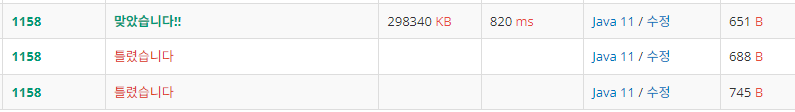

# 요세푸스 문제
## 문제
- 요세푸스 문제는 다음과 같다.

- 1번부터 N번까지 N명의 사람이 원을 이루면서 앉아있고, 양의 정수 K(≤ N)가 주어진다. 이제 순서대로 K번째 사람을 제거한다. 한 사람이 제거되면 남은 사람들로 이루어진 원을 따라 이 과정을 계속해 나간다. 이 과정은 N명의 사람이 모두 제거될 때까지 계속된다. 원에서 사람들이 제거되는 순서를 (N, K)-요세푸스 순열이라고 한다. 예를 들어 (7, 3)-요세푸스 순열은 <3, 6, 2, 7, 5, 1, 4>이다.

- N과 K가 주어지면 (N, K)-요세푸스 순열을 구하는 프로그램을 작성하시오.

## 입력
- 첫째 줄에 N과 K가 빈 칸을 사이에 두고 순서대로 주어진다. (1 ≤ K ≤ N ≤ 5,000)

## 출력
- 예제와 같이 요세푸스 순열을 출력한다.




## 풀이

- 제로베이스 요구사항은 연결리스트를 활용해서 문제를 푸는 것이었다.
- 우선입력을 구현하고, 연결리스트에 1~N만큼의 데이터를 채운다.
  
```java
Scanner sc = new Scanner(System.in);
        int N = sc.nextInt();
        int K = sc.nextInt();
        LinkedList<Integer> LL = new LinkedList<>();
        for (int i = 1; i <= N; i++) {
            LL.add(i);
        }
```

  

리스트 LL에 N까지의 숫자가 정상적으로 추가된 것을 볼 수 있다.  
예제 출력을 보면 3,6,2,7,5,1,4 순서로 제거된 순열이 출력되는 것을 볼 수있는데  

  

이런식으로 리스트의 제일 앞의 값을 제일 마지막으로 순회시키면서 K번째가 제일 앞에 왔을때 그것을 빼버리고 출력하면 될 것 같다.  
이때 출력은 제거된 원소를 배열 형태로 출력하는 것이 아닌 <>안에 제거된 원소가 출력되는 형태로 하는 것에 유의해야 한다.

```java
        System.out.print("<");
        while (LL.size()>1){
            for (int i = 1; i < K; i++) {
                LL.addLast(LL.removeFirst());
            }
            System.out.print(LL.removeFirst()+", ");
        }
        System.out.print(LL.removeFirst()+">");
    }
}
```
  

K가 3일때 매 3번째 원소를 제거하여 출력하는데 순서를 확인해보면 예제출력과 같다.

### 최종코드
```java
import java.util.LinkedList;
import java.util.Scanner;

public class notepad2 {
    public static void main(String[] args) {
        Scanner sc = new Scanner(System.in);
        int N = sc.nextInt();
        int K = sc.nextInt();
        LinkedList<Integer> LL = new LinkedList<>();
        for (int i = 1; i <= N; i++) {
            LL.add(i);
        }
        System.out.print("<");
        while (LL.size()>1){
            for (int i = 1; i < K; i++) {
                LL.addLast(LL.removeFirst());
            }
            System.out.print(LL.removeFirst()+", ");
        }
        System.out.print(LL.removeFirst()+">");
    }
}
```


출력부분에서 몇번 오차가 있었으나 최종적으로 구현에 성공하였다.