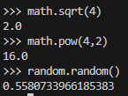
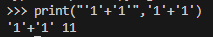
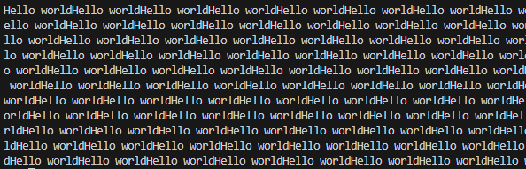
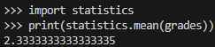

# Python
Python은 VScode의 터미널을 사용해 진행

- a=1;b=1;a+b  
  라고 입력하면 마지막a+b가 끝나느 대로 2가 출력.
- 마지막에 \를 입력하는 것으로 실행을 유보시키는 것이 가능하다.
## 데이터 타입
- Number
  - 숫자(1,2,3....)
  - 1+1 등의 문법으로 사용
- Text
  - 문자("Hello World")
  - len("Hello World") //문자의 길이 출력
- 데이터 타입의 종류와 연상방법을 숙지할 것.
### 숫자형 데이터 타입
- 정수형과 실수로 나눠진다
  - int -1,0,1 등의 정수
  - float 1.1 등의 실수  

print('1+1',1+1) 입력시 ,로 구분되어 출력되며 ''안에 들어간 입력은 그대로 출력, 뒤에 1+1은 계산 값이 출력된다.  

import math // 산술연산보다 더 많은 기능을 사용하기 위한 임포트
```python
import.math
print('math.sqrt(4)',math.sqrt(4)) //4의 제곱근 계산 메서드
print('math.pow(4,2)'math.pow(4,2)) //1을 2만큼 곱하는 메서드
import random
print('random.random()',random.random) 랜덤 실수 출력 메서드
```
### 출력예제
  

## 문자열 데이터 타입
- '',""로 묶어서 표현한다.
- 줄바꿈을 표현하기 위해선  
print('''  
Hello  
world  
''')  
이런식으로 3개를 써서 표현한다.
- 문자열 덧셈
  - print("'1'+'1'",'1'+'1')은  
  2가아닌 11로 출력된다.
  

- 문자열 곱셈
  - print('Hello world'*1000)
   
이런식으로 1000번 출력된다.  

- 문자 치환
  - print('Hello world'.replace('world','universe'))  
  //world를 universe로 치환한다.

## 리스트 데이터 타입
 - 비슷한 성격의 데이터를 묶어서 관리하기 용이한 데이터 타입
 - students =["egoint","sori","maru"]
 - grades = [2,1,4]  
  
리스트의 순서는 0번째부터이니 students[1]을 출력하면 sori가 출력된다.
- len(students)는 3이나온다. 자료의 갯수가 3개니까
- min(grades) = 1
- max(grades) = 4
- sum(grades) = 7
  - 등으로 숫자형 데이터 타입 리스트는 계산 메서드 사용가능

List는 통계에서 자주 사용한다.
- statistics(통계)모듈을 자주사용
```python
import statistics
print(statistics.mean(grades))
```

통계모듈을 사용해서 평균값을 구했다.

```python
import random
print(random.choice(students))
```
students 내부 데이터중 랜덤으로 하나를 출력해주는 기능

## Documentation(사용설명서)
- 파이썬 홈페이지 Documentation  
항목 확인할 부분은
  - Library reference
  - Language reference  
  
  전자는 부품, 후자는 부품을 결합하는데 사용하는 데이프라고 이해하면된다
---
공부할때 Tutorial을 유용할것.
한국어로도 볼 수 있음!

## 변수
- price, vat_rate 등 특정값이나 데이터에 이름을 붙여 효과적으로 계산할 수 있게 만들어주는 것

```python
name ='sori'
message = 'hi, '+name+' ..... bye, '+name+'.'
print(message)
```
변수의 사용법은 자바의 그것과 동일하다

## 디버그
- 문제를 일으키는 코드를 찾는데는 print 함수가 유용.
  - ex) 코드를 반씩 잘라가며 print를 사용하여 오류가 발생하는 부분을 찾는 방법이 있다.
- 각 프로그램에 맞는 디버그 기능을 이용하여 오류검출을 철저히 할 것

## 입력과 출력
- 입력(input)
  1. keyboard
  2. file
  3. mic
  4. cam
  5. sensor  

  Process에 데이터를 입력하는 무언가
- 출력(output)
  1. monitor
  2. paper
  3. file
  4. speaker  

  Process에서 입력받은 데이터를 처리하여 출력하는 무언가
  
```python
name ='sori'
message = 'hi, '+name+' ..... bye, '+name+'.'
print(message)
```
이 코드에서 변수name에 들어갈 이름을 직접 입력하고 싶다
```python
name = input('name: ')
message = 'hi, '+name+' ..... bye, '+name+'.'
print(message)
```
 이런식으로 바꿔주면

바뀐 변수로 출력이 가능

## pypi pip
자바 json때 했던것처럼 다른 사람이 만들어둔 메서드(모듈)을 다운받아 import하여 기능을 사용할 수 있게 만들어주는 것.
- https://pypi.org/project/pip/
  - pip를 다운받아 사용할 수 있는 사이트