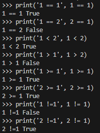
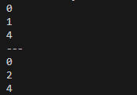
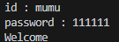
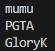

# Python 제어문
- Flow Control
  - 조건문과 반복문

## Boolean
- ture 혹은 false로 표현되는 제어문

- 비교연산자
   ```python
  print('1 == 1', 1 == 1)  
  print('1 == 2', 2 == 1)  
  print('1 < 2', 1 < 2)  
  print('1 > 1', 1 > 2)  
  print('1 >= 1', 1 >= 1)  
  print('2 >= 1', 2 >= 1)  
  print('1 !=1', 1 != 1)  
  print('2 !=1', 2 != 1)
  ```
    
true or false로 값을 표현

## 조건문
### if ~
- 하나의 프로그램으로 여러가지 형식을 표현할 수 있는 방법
  ```python
  print(0)  
  if True:
    print(1)
  print(2)
  print('---')
  print(0)  
  if False:
    print(1)
  print(2)
  ```
    
- if문 안쪽을 입력할 때 tab을 사용하거나 스페이스바로 공백을 주거나 할때 통일해서 사용해야한다
- Ex2
  ```python
  input_id = input('id : ')
  id = 'mumu'
  if input_id == id:
    print('Welcome')
    ```
- 입력한 id값이 id와 같으면 Welcome을 출력한다.  
  
이런식으로

### if ~ else ~
```python
print(0)
if True:
    print(1)
else:
    print(2)
print(3)
print('---')
print(0)
if False:
    print(1)
else:
    print(2)
print(3)
```
  
- 조건에 따라 다른값을 출력하게 만드는 것이 가능하다.

### elif~
- if ~ elif ~ else로 사용한다.
- elif는 여러개가 존재할 수 있다.

```python
print(0)
if True:
    print(1)
elif True:
    print(2)
else:
    print(3)
print(4)
print('---')
print(0)
if False:
    print(1)
elif True:
    print(2)
else:
    print(3)
pirnt(4)
```
  
조건에 따른 출력의 차이를 확실히 알것.

### 조건문 중첩
 ※ 이중 for문처럼 쓰는건가?
 - 예제 코드
  ```python
  input_id = input('id : ')
id = 'mumu'
input_password = input('password : ')
password = "111111"
if input_id == id:
    if input_password == password:
        print('Welcome')
    else:print('Wrong password')
else:
    print('Wrong id')
```
조건에 따라 다른 값을 출력하게 만들어주는 것  


### 반복문 - for
- 반복문과 List는 단짝  

사용예시는
```python
for (변수명) in (리스트)
names = ['mumu','PGTA','GloryK']
for name in names:
    print(name)
```
  
출력은 이런식으로! 자바의 for문가 동일하니 잘 알아두자!

### 다차원배열
- 2차원~, 3차원~~ 다차원배열
- 예제코드
```python
persons=[
    ['mumu','초월','공돌이'],
    ['PGTA','서하','백수'],
    ['GloryK','팡주','땔감'],
]
print(persons[0][0])
for person in persons:
    print(person[0]+','+person[1]+','+person[2])

name=person[0]
address = person[1]
interest = person[2]
print(name,address,interest)
//이런식으로 설정도 가능하고
//아래처럼 표현도 가능하다
name, address, interest = ['mumu','초월','공돌이']
for name, address, interest in persons:
    print(person[0]+','+person[1]+','+person[2])
//해당 설정을 이용하여 for문을 이런식으로 치환해주는것도 가능하다
```


### 사전형 반복문 Dictionary+Loop
- 다차원리스트 각각의 원소에 이름을 붙이는 것.
- Key와 Value로 묶어주는방식
  - ['mumu','초월','공돌이']
-> {'name':'mumu','address':'초월','interest':'공돌이'}
- name, address,interest가 Key, 그 뒤의 값이 Value가 된다.
```python
person = {'name':'mumu','address':'초월','interest':'공돌이'}
print(person['name'])

for key in person:
    print(key, person[key])

persons = [    
    {'name':'mumu','address':'초월','interest':'공돌이'},
    {'name':'PGTA','address':'서하','interest':'백수'},
    {'name':'GloryK','address':'팡주','interest':'땔감'}
    ]
print('=== persons ===')
for person in persons :
    for key in person:
        print(key, ':', person[key])
    print('----------------')
```
  
출력값은 이러하지 자바의 이중for문가 비교해보고 잘 확인할것!