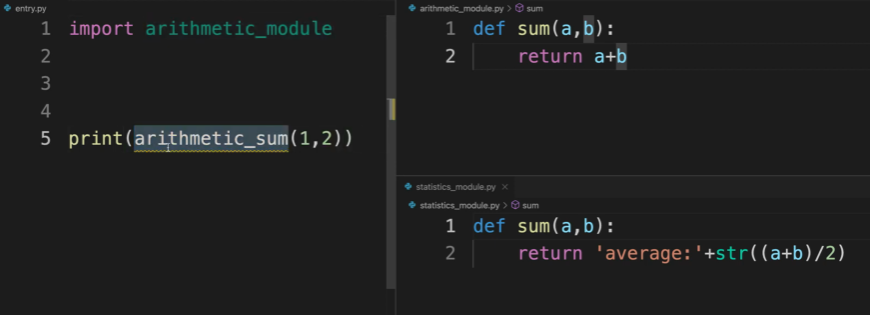
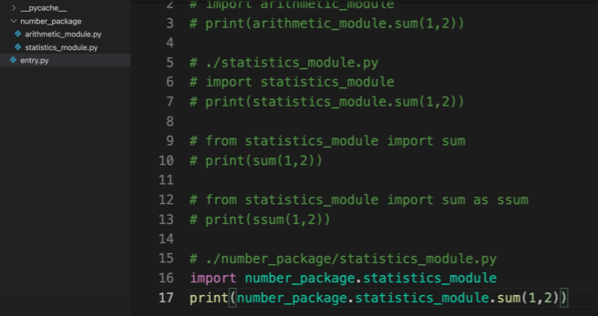

# 모듈과 패키지
- 코딩은 정리정돈이 반.
- 연관된 코드를 그룹핑해서 파일에 저장한것이 Module.
- 연관된 Module을 폴더에 모아서 합친것이 Package.
- 하나의 파일에 코드를 다 담기가 어렵고 찾기도 힘들다. 동일한 이름으로 정의되어 의도와는 다르게 실행되는 코드도 있을 수 있음.

코드를 다른 파일로 나누고 import하여 사용가능.  
- import는 관습적으로 맨 위에 적으나 그렇게 적지않아도 사용할 수 는 있다.

  
- import한 모듈의 내부 함수의 변수명을 재정의해서 사용가능하다.
  - ssum은 statistics모듈의 sum과 동일한 기능을 하게만듯 것

number_package라는 디렉토리 안에 두개의 모듈을 집어넣어 위처럼 경로를 전부 적어 모듈을 사용하는 방법도 있다.
- 개발중 코드가 늘어나면 늘어날수록 모듈, 패키지를 사용하여 효율적으로 오류를 방지할 수 있도록 한다.