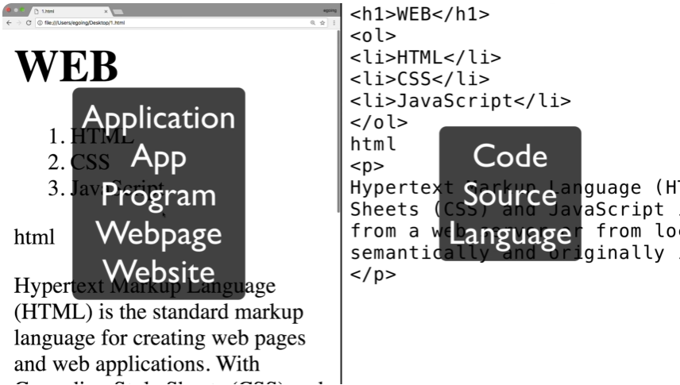
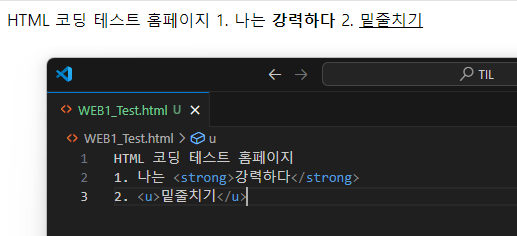
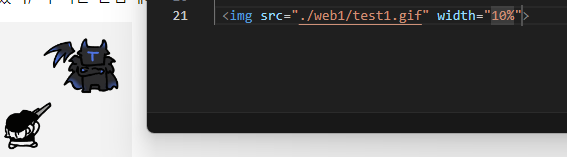
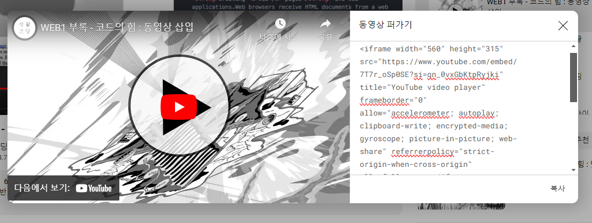

# WEB1

## 1. HTML
- 웹페이지를 만드는 언어
- Public Domain으로 저작권이 없는 개발 언어
  
### 기본문법(TAG)(</>)
1. 기본 text 작성.
 -  작성한 그대로 표시된다
2. <strong>strong</strong>
  - <>안에 strong을 써서 텍스트를 감아주면 강조할 수 있다.
3. <u>underline</u>
  - 밑줄을 쳐서 강조할 수 있다.
  
etc....
  

- 이러한 </>로 사용하는 HTML의 문법을 TAG라고 한다.
- 우리는 </>가 TAG라는것을 배웠으므로 정확하게 무슨 기능을 하는지 몰라도 검색을 통해 어떤 기능을 가진 TAG인지 알아볼 수 있게되는 것이다.
- HTML에는 현재 약 150개 이상의 TAG가 존재한다.
4. br
- h1~h6을 제외한 텍스트들을 제외하곤 줄바꿈이 안되고 계속 지멋대로 써진다. 줄바꿈도 TAG를 활용하여 구현할 수있는데 이것이 br이다.
5. p
- p를 이용하여 감싸주면 해당 텍스트들은 하나의 문맥으로 취급된다.  
- p는 br에 비해 시각적 자유도가 떨어지는 단점이 있다.
- CSS를 통해서 시각적으로 부족한 부분을 정교하게 제어해줄 수 있다.  

※ HTML은 접근성(accessibility)가 매우 중요하다.

### 속성&IMG
1. img
- img를 HTML에 삽입하는 태그
  - img만으로는 정보가 부족하므로 src=""로이미지의 정보를 추가해줘야한다.

- 이런식으로 img TAG 안에 입력되는 src,width등의 추가 정보를 Attribute(속성)이라고 표현한다.

## 2. 부모자식과 목록
- 태그가 서로 포함관계로 연관되어 있을 때 포함하고 있는 태그를 '부모태그', 포함된 태그를 '자식태그'라고 부른다.

1. li
 - 목차를 만들어주는 태그
 - 의 부모태그 ul이 있다.
 - ul(Unordered List)은 각 목차를 그룹핑 해서 경계를 짓게해준다.
 - li는 ul이라는 부모 태그를 반드시 가지고 있다.
2. ol(Ordered List)
- ul대신 ol을 사용하면 그룹핑 된 각 항목에 자동으로 오름차순으로 번호를 붙여준다.
3. table 태그는 tr,td와 부모자식 관계를 가지고 있다.
   - table
     - tr
       - td

## 문서의 구조와 슈퍼스타들
- 정보가 많아질수록 잘 정리정돈하기 위한 체계나 구조가 필요하다.

1. title
   - 해당 웹페이지의 이름을 명시적으로 알려준다. 책 표지와 같은 역활
2. meta
   - 해당 홈페이지 유니코드 등을 설정해 줄 수 있는 태그  
         ex) meta charset="utf-8">
3. head & body
   - 홈페이지는 즉 노출되는 부분인 '본문'과 본문을 작성하기 위한 여러가지 태그들(title, meta등등....)의 집합을 따로 설정하기로 했다.
   - 본문은 body의 태그로 묶기로
   - 본문(body)를 설명하는 태그는 head태그로 묶기로 약속했다.
4. HTML
   - 그리고 모든 헤드와 바디 태그는 HTML이라는 커다란 태그 하나로 묶여있다.
5. !DOCTYPE html> 
   - 그리고 해당 문서가 html로 쓰여있다는 것을 말해주기 위해 최상단에 관용적으로 해당 태그를 표시해준다.

## 웹페이지의 완성
각 항목에 하이퍼링크를 주어 웹페이지를 책처럼 엮어 웹페이지를 완성할 수 있다.
- a href=""
  - 선택한 위치에 하이퍼링크 주소를 넣음으로써 원하는 위치로 보내는 것이 가능하다

### 원시웹
Internet과 web은 다르다.  
인터넷이 도시라면 웹은 건물이다.  
인터넷은 웹을 만나면서 폭발적으로 확장하였다

## 서버와 클라이언트
정보를 요청하는 컴퓨터는 클라이언트, 해당 요청에 대해 대답하는 컴퓨터를 서버라고 칭한다.
- 게임을 하는 우리의 핸드폰은 클라이언트, 게임의 정보가 담긴 회사의 컴퓨터는 서버

## 동영상 삽입
- iframe

동영상 등의 sorce나 퍼가기를 통해 iframe이라는 태그로 구성된 코드를 볼 수 있는데 요것을 이용하면 동영상을 삽입하는 것도 가능하다.

### 추가기능
댓글기능, 채팅기능, 방문자 분석기 등 백 엔드라 불리는 부류를 활용하여 웹사이트를 더 다양하게 꾸밀 수 있다.
https://youtu.be/LVLHprUg-PM?si=AG72bU0HTXZ3qlSr  
참고할 것!