# WEB2 - CSS
웹사이트를 좀 더 보기좋게 만족스럽게 만드는 디자인에 최적화된 언어.  
그 이전에는 TAG를 사용해서 HTML을 꾸몄으나, 과도한 사용으로 인해 웹페이지의 정보로서의 가치가 현격하게 낮아져버리는 현상이 발생하면서 등장했다.

- !--와 -->를 통해 HTML에 있어 흔히 말하는 주석 처리가 가능하다

## 사용법
style태그를 사용한다.  
style태그를 사용한 내부의 코드는 CSS언어 문법에 맞게 해석하여 처리해야 된다고 명시한다.
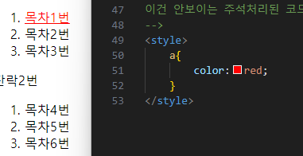
a태그를 사용한 하이퍼링크의 색깔을 빨강으로 바꾸는 코드

- 이전에 사용하던 중복된 태그들을 제거하여 성능을 향상시키고 수정을 용이하게 한다.
- 유지보수가 용이, 가독성의 상승

## 기본문법
위 사용법으로는 표현에 한계가 있기때문에 a 태그에 직접 css코드를 집어넣는 방식이 사용된다.
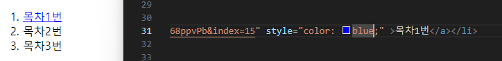

- style 내부에 들어가는 a와 같은 태그들을 선택자(selector)라고 부르며 해당 태그에 사용되는 코드들을 효과(declaration)이라고 부른다.
- 다만 태그에 직접 css코드를 추가하는 방식에서는 선택자가 필요하지 않다.
- 즉 사용법에는 style태그를 쓰는 것과 style속성을 쓰는 두 가지 방법이 있다.

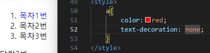

이런 식으로 style태그와 속성을 사용할 수 있다.
style태그르르 사용할 때 각 효과들은 세미콜론(;)으로 구분한다.
-> 프로그래밍 언어랑 동일한 느낌

## 속성 알아내기
- Property는 css의 효과를 나타내는 말이다.
- 그럼 이제 css를 사용하는 필요한 코드를 알아내는 방법을 알 수 있다.
  - h1으로 감싼 text의 크기를 변경하고 싶다면 css text size property 등으로 검색해보자  

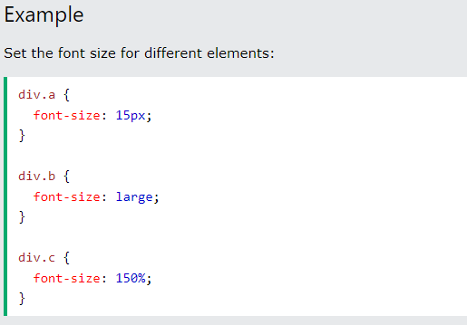
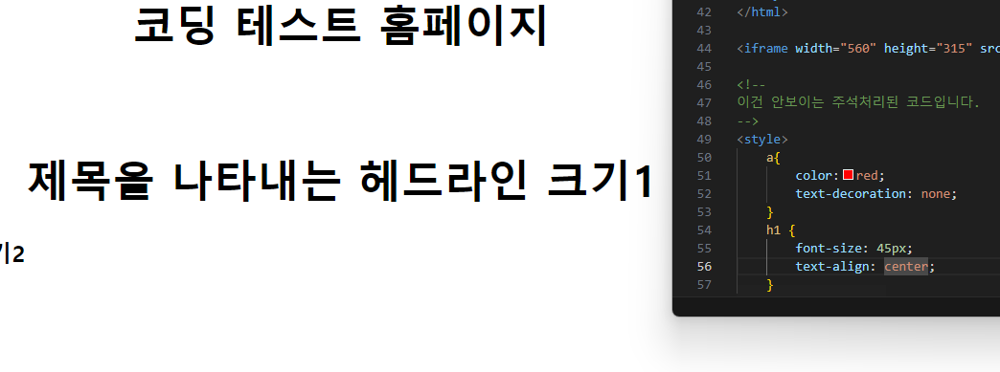
검색해서 알아낸 속성을 통해 이런식으로 꾸미는 것도 가능하다!

## 선택자의 기본
- a 태그로 묶인 텍스트에 대해서 일괄적인 변화를 주고자 하면 style태그를 사용하면 되고  
  각 개체에 대해 개별 변경이 필요하다면 css코드를 해당 a태그 내부에 직접 써넣는 방식을 사용하지만  
  몇가지를 묶어 사용하고 싶을때는 이러한 방식이 제한된다.
- 이럴 때는 묶어서 사용하고 싶은 텍스트나 태그에 class를 추가해서 하나로 묶어 style태그를 사용하는 방법이 있다.

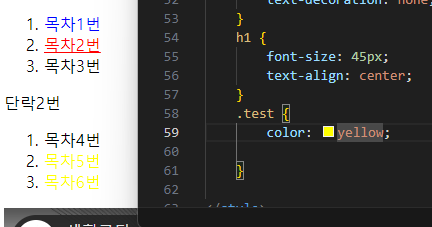
클래스를 선택하여 수정할때는 .클래스명으로 작성한다.  
※ 다만 이 방식은 하나의 텍스트에 여러가지 class를 사용할 경우 텍스트의 가장 가까운 class의 명령어만 수행되기 때문에 여러가지 오류를 발생시킬수가 있다.
### ID선택자
id="class명"등을 사용하여 더 세부적으로 제어해줄 수 있다.
- id선택자 > class선택자 > TAG선택자 순으로 영향력이 강하다.
- 영향력이 같다면 가장 마지막에 등장하는 선택자가 우선순위가 높다.
- 단, ID선택자는 단 한번만 사용되어야 한다. ID는 중복되어서는 안되는 유일무이한 값이다.  
  ※ <strong>남발하지 말라는 이야기다</strong>
  
## 박스 모델
- 화면 전체를 쓰는 태그는 블럭(block level element)라고 칭한다
- 자기자신의 부피만큼의 크기를 가진 태그는 인라인(inline element)라고 칭한다.

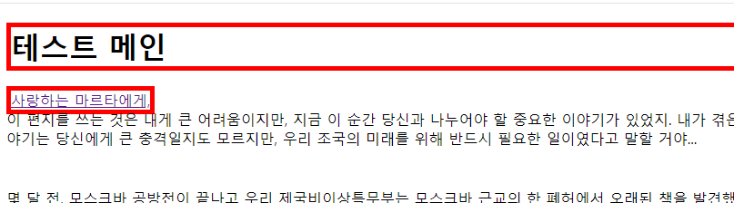
h1과 a에 똑같은 css코드를 입력하더라도 블럭이냐 인라인이냐에 따라 작동하는 방식이 다르다. 꼭 기억해둘것
display:inline코드를 사용해 블록도 인라인처럼 사용할 수 있다.  
반대도 가능하다.

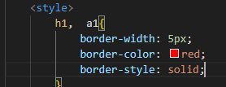
두 개의 태그의 CSS가 중복된다면 ,를 이용하여 묶어줄 수 있다.

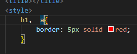
중복된 코드를 더 줄여줄 수 있다.  
이때 5px solie red의 순서는 상관없다.

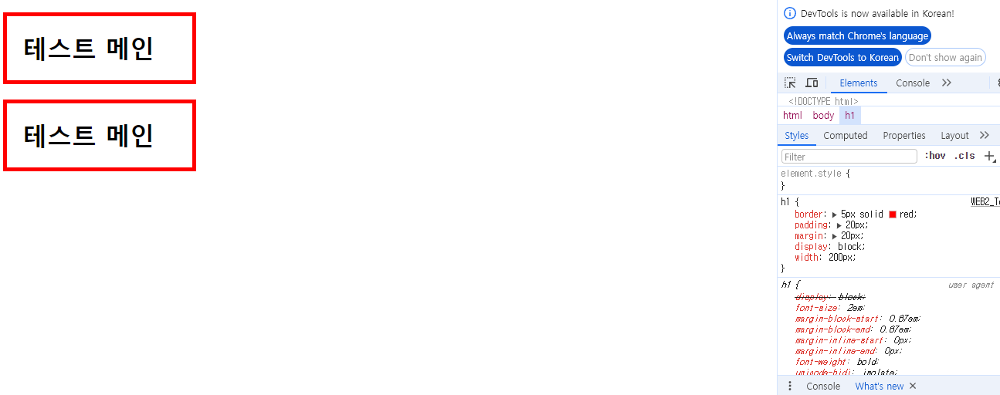
- 검사를 통하여 해당 태그가 어떤 style를 받고있는지 확인하는 것도 가능하다.  
-  프래그래밍언어의 디버그 같은 느낌으로 오류 수정하는데 도움 받을 수 있다.

## 그리드
div라는 아무의미도 없는 태그를 이용해 각 텍스트 사이에 구분을 지어줌과 동시에 CSS를 적용하는 것 또 한 가능하다.

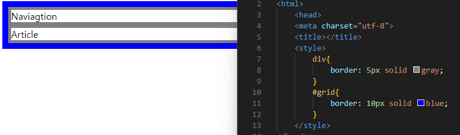
다만 해당 기능을 사용하기 위해서는 부모태그로 감싸줄 필요가 있다.

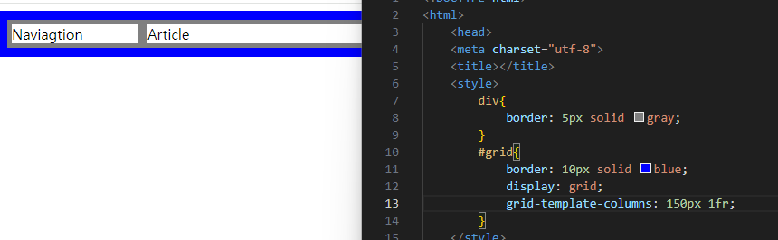
그리드 템플릿을 사용하면 첫번째 네비게이션은 150px로 고정, 1fr로 아티클은 창의 크기에 따라 전체적으로 늘어나는 형식으로 만들 수 있다.

## 미디어 쿼리
화면의 크기에 따라서 웹 페이지의 각 요소들이 반응해서 최적화된 모양으로 바뀌게 하는 것.
 - 반응형 웹 디자인
 - PC뿐만 아닌 모바일/패드 등의 다양한 기기에서 호환되어 작동할 수 있게 만드는 기버

- ex)
  ```
  @media(min-width:800px){
    div{
        display: none;
        }
    }
    ```
브라우저 창이 800px을 넘어가면 
해당 태그의 내용무링 보이지 않게 설정하는 것을 시작으로 응용이 가능하다.  
프로그래밍 언어의 조건문 같은 느낌

## CSS코드의 재사용
비슷한 양식으로 모든 홈페이지가 작성되었을때 일부의 변경사항이 있어 수정해야 할 때 모든 웹페이지의 코드를 수정해줘야한다.
그것을 방지하기 위해 style부분을 따로 CSS파일로 저장하여 link태그를 사용하여 불러올 수 있다.  
ex) link rel="stylesheet" href="test.css">
- 홈페이지의 링크가 많아져도 이런식으로 중복제거가 가능하다
- 재사용성이 높아진다