# JavaScript
- 웹페이지도 동적으로 사용자와 상호작용 하길 원해서 태어난 언어.
- html을 통해 만들어진 웹페이지에 자바 스크립트를 이용해서 사용자와 상호작용을 할 수 있도록 추가하므로서 웹페이지의 정보와 자바스크립의 기능을 가진 유일무이한 시스템으로 성장.

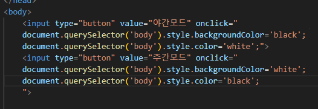
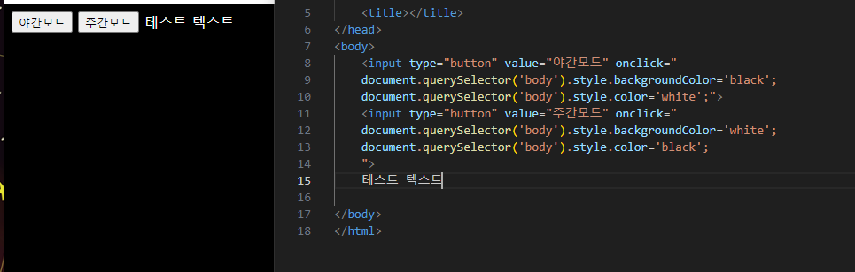
주간모드를 클릭하면 반대로 변하는 등, 사용자의 조작에 따라 상호작용이 가능하다.
즉 자바스크립트는 html을 제어하는 언어인 것이다.

## 사용법
body 태그 안에 script라는 태그를 집어넣어서 이 태그 안에는 자바스크립트가 오도록 한다.

java의 print와 같이 화면에 출력하는 코드는 write('')이다
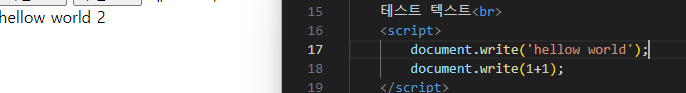
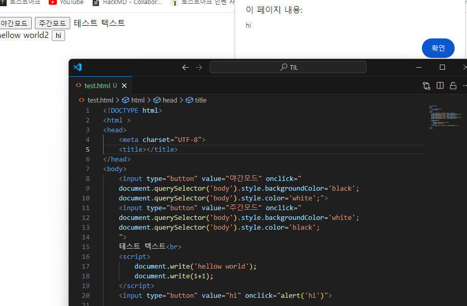
- 상호작용을 통해 동작하는 것을 JS에서는 이벤트라고 한다.

- input type의 값을 통해 어떤식으로 동작할지 정해줄 수 있다
  - 버튼이나 텍스트 입력창 등
- value값을 통해 동작하는 기능의 이름을 적어줄 수 있다.
- 해당 동작을 수행할 때 어떤 출력값을 줄것인가? 를 수행하는 기능이 있고 이것을 <u>이벤트</u>라고 부른다.
  - onclick, onchange, onkeydown 등

### html & JS
인터넷 브라우저의 콘솔창에서는 파일을 생성하지 않고도 JS를 사용할 수 있다.

## 자바스크립트의 데이터 타입
1. 숫자
- 일반 숫자와 산술연산자(+,-,*,/) 등은 입력하면 입력하는데로 표현된다
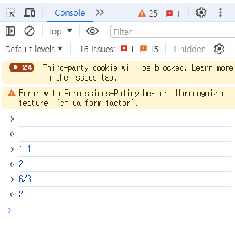
2. 문자열
- 문자열은 ''를 통해 입력가능하며 이것과 상호작용이 가능한 코드들도 있다.
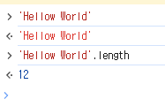

## 변수와 대입 연산자

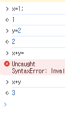  

기존에 배운 변수와 대입연산자(=)와 똑같다.
※ 변수 앞에 var(variable)을 붙여서 쓰는게 좋다.

## JS의 조건문

자바와 사용법은 거의 동일하다

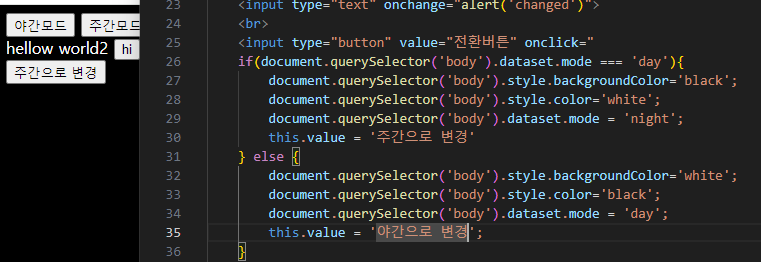 
사용법 숙지

## 비교연산자와 블리언
- ===(동등비교 연산자)
  - 연산자의 왼쪽과 오른쪽 값이 같은가에 따라 Ture or False를 출력한다.
  - 이 ture와 false로 출력되는 값을 boolean이라고 한다.
  
## 리팩토링
- 코드의 가독성을 높이고 중복된 코드를 줄이고 유지보수가 용이해지도록 코드를 개선하는 작업.
- 소프트가 커지고 고도화되는 과정에서 틈틈히 리팩토링을 해 성능을 개선시켜줘야 뛰어난 프로그램이 된다.

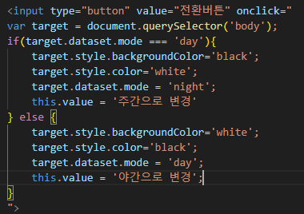 
해당 예시처럼 중복되는 코드를 처리해 동일한 기능을 하지만 코드의 수를 줄이는 방법이 있다.

## 배열(Array)

- java와 사옹법은 거의 같다.   
- JS만의 문법에 주의

## 반복문
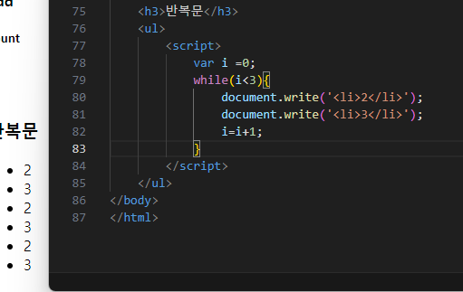
자바에서 배운 것과 같음.
JS문법에 유의하여 확인할것.

## 함수
- 중복사용하는 기능을 funtion(메서드)로 따로 만들어서 사용함으로써 프로그램에 사용되는 코드의 양을 획기적으로 줄이는 방식.
- 자바가 void funtionname()로 쓰는 것처럼 JS는 funtion funtionname()로 사용한다.

### 매개변수와 인자
- 함수는 입력과 출력으로 이루어져있는데 입력에 해당되는것이 매개변수(parameter)와 인자(argument)라고 하고  
출력에 해당하는 것을 return이라고 한다.

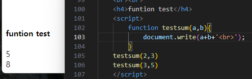
해당 예시에서 함수에 전달하는 2,3과 3,5를 인자(argument)라고 하고  
testsum안에 입력된 a와b를 매게변수(parameter)라고 부른다.

## 객체
- 함수도 편리한 기능은 많으나 이 함수도 수가 많아지면 한계에 부딫치게 된다.
  서로 연관된 함수나 변수를 같은 이름으로 그룹핑해서 정리정돈하는 도구를 객체라 할 수 있겠다.

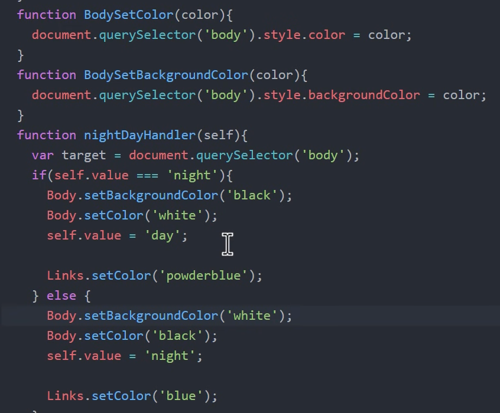
서로 연관된 코드들을 함수로써 정리하고 이 함수들을 Body, Linnks라는 객체에 담았다.  
※ 마찬가지로 JS에서 출력에 사용하는 document.write 등에서  
document 역시 객체이다.

## 객체 프로퍼티와 메소드
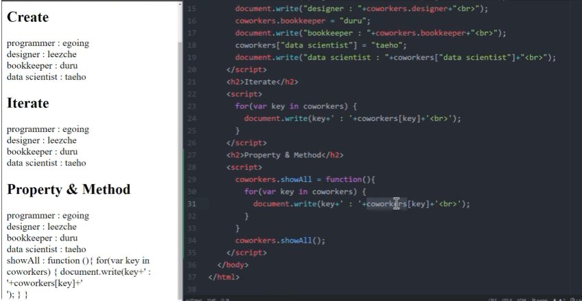
- 객체에 소속된 변수의 값으로 함수를 지정하는 것도 가능하고, 객체에 소속된 함수를 작성할 수 있다
-  객체에 소속된 함수를 메서드라고 칭한다.

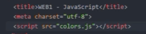  
- 만들어진 스크립트를 다른 여러 웹페이지에서 사용해야 하는 일이 있을 때 각 페이지마다 일일히 붙여넣는 것이 아니라 js파일로 만들어서 script>부분을 제외하고 붙여넣은 뒤 스크립트에 src를 사용하면 편리하게 여러 웹페이지에 적용시킬 수 있다.
- colors.js파일을 수정하면 적용된 모든 페이지 전부가 수정된다.
  - 유지보수가 용이하다.
- 다운로드가 발생하나 cache를 통해
  네트워크 트래픽 제어나 비용절감에 용이하다.

## 라이브러리와 프레임워크
- 라이브러리(library)는 내가 만들고 있는 프로그램에 사용할 부품을 가져오는 형태
- 프레임워크(framework)도 비슷한 의미이지만 만들고자 하는것이 무엇이냐(기획의도)에 따라,  
사용자가 처음부터 전부 구현하지 않아도 되도록 만들어주는 반(half)제품같은 것이라고 할 수 있다.
### 라이브러리
- jQuery   
  - 가장 오래됐고 안정적인 라이브러리.
  - 라이브러리는 사용하지 않을때보다 사용했을때 생산성이 높아진다.
  - 직접 다운로드 하는 방법이 있고 CDN이라는 소스(src)로 네트워크에 저장해 배포하는 라이브러리를 가져와 사용할 수 있다.
  
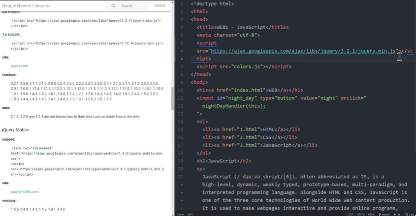
- jQuery 함수는 $('a') 형식으로 사용하며 그 의미는 '이 웹페이지의 모든 'a'태그를 jQuery로 제어하겠다는 의미이다.

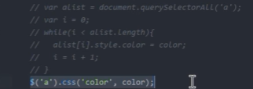
- 같은 기능을 구현했으나 주석처리된 코드에 비해서 훨씬 효율적으로 변한 코드를 볼 수 있다.

### UI & API
- UI : User Interface
  - 사용자가 시스템을 제어하기 위해서 사용하는 조작장치
- API : Application Programming Interface
  - 어플리케이션을 만들기 위해서 프로그래밍을 할 때 사용하는 조작장치
  - 우리의 의도가 반영되어 만들어지나 그 토대가 되는 기본적인 것은 누군가에 의해 만들어져있는 것