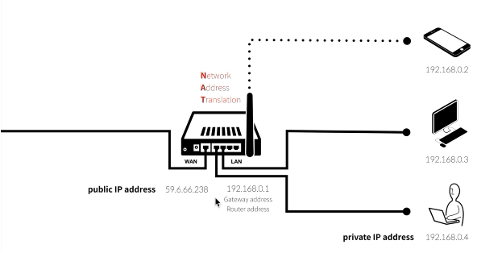

# WEB2 - Home server

## 라우터(공유기)

- 클라이언트와 서버 간의 통신을 위해서는 1개 이상의 회선이 필요한데 실질적으로 가정집에서 여러개의 회선을 구비하는데는 비용적으로 문제가 있어 현실적이지 않다.  
- 때문에 회선은 하나를 계약하되 WAN과 연결되는 라우터를 하나 설치하여 해당 공유기로 LAN(지역 네트워크)의 장비들이 전부 회선에 접속할 수 있는 것이다.  
- 즉 WAN과 LAN에서 동시에 사용할 수 있는 중계기의 일종이다.  
- WAN에 접속하는 ip는 public ip address, LAN에 접속하는 ip는 Router address라고 한다.

## NAT(Netword Address Translation)

- 사설 네트워크(지역 네트워크)를 효율적으로 관리할 수 있게 해주는 기술
- private IP address가 public IP address를 통해 외부와 통신할 때 상호 통신이 가능하도록 라우터에서 ip정보를 수정해서 응답해주는 과정

## PORT
외부에서 접속이 들어올때 지역 네트워크 중 어떤 기기에서, 어떤 프로그램과 상호작용을 할 것인가를 명확하게 하기 위한 개념.
각 네트워크, 프로그램마다 가지고 있는 약 6.5만개의 포트 중에서 서로 '어떤 포트로 통신할 것인가'를 정해두고 각 통신간의 정보를 정확하게 교환하게 위한 것.

## port forwarding
- 외부에서 들어온 특정 ip를 내부 네트워크의 특정ip에 전송하기 위해 라우터에서 이것을 저장해 안내자 역활을 하는 것.
- 즉 특정ip의 외부포트에서 들어오는 정보는 특정 내부포트로 무조건 보낸다고 고정해놓는 것. 

## Dynamic & Static IP address
- ISP를 통해 각 장비에 IP주소를 분배해주나 모든 장비들에 IP주소를 부여해주면 턱없이 부족해진다.  
  이 때 사용하지 않는 IP를 ISP가 회수한 후 필요한 장비에 재분배해준다.  
  즉 IP가 동적으로 바뀌는 것이다(이른바 돌려막기).
  - 웹 호스트같은 경우 회수전에 사용했던 ip로 접속했을 때 그 ip를 새로 부여받은 다른 주소로 접속할 수 있다.     
    이것이 dynamic 주소의 단점이다.
- 이런 사태를 방지하기 위해 통신사에 비용을 추가로 주고 IP를 고정하는 방식도 있다(Static IP address)

## DHCP(Dynamic Host Configuration Protocol)
- 원래는 새로운 장비를 공유기에 연결하면 해당 장비의 ip를 직접 정해줘야 한다.
- 그러나 잘못 혹은 중복으로 지정했을때 하나의 요청에 두개의 장비가 응답하는 등의 오류가 발생할 수 있다.
- 때문에 새로운 장비가 DHCP 클라이언트를 통해 DHCP 서버(공유기)에 mac주소를 토대로 새로운 ip할당을 요청하고 공유기에서 이를 수용해 새로운 ip를 할당해준다(일정 시간동안만).