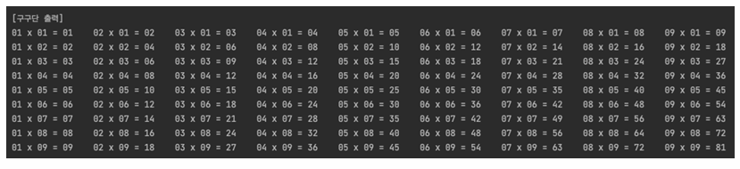
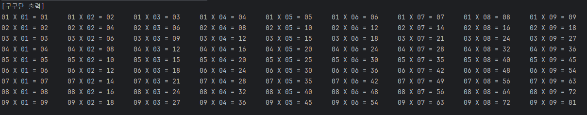
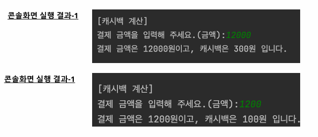
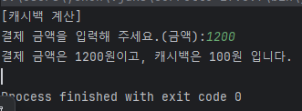
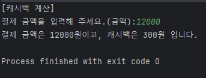
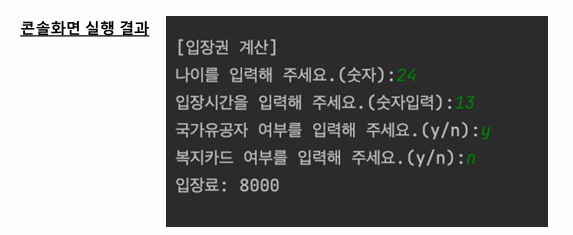
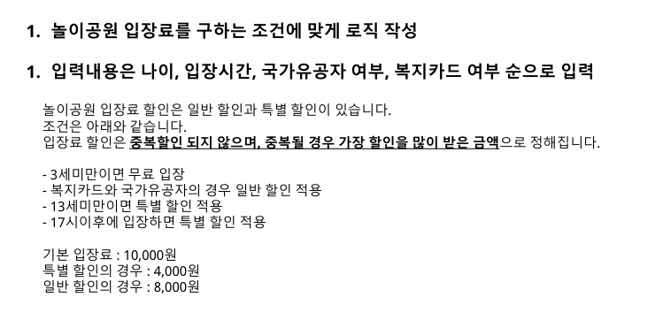
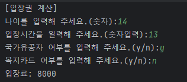

# 과제 1 구구단 출력하기
- 수행목적 : JAVA의 다중반복문과 format함수를 이용하여 주어진 조건에 맞는 로직 작성
- 간략소개 : 반복문의 기본을 학습하는 진부하면서도 고전프로그램인 구구단을 화면에 출력
하는 프로그램을 작성해주세요  

예시

첫번째 줄에 1~9단의 첫줄이 출력되며
순차적으로 다음 숫자가 출력되게 만든다.

2중for문을 활용하면 간단하게 작성할 수 있다.
```java
 public static void main(String[] args) {
System.out.println("[구구단 출력]");
for (int i = 1; i <= 9; i++) {
    for (int j = 1; j <= 9; j++) { //1단부터 9단까지 줄수는 9개
        System.out.printf("%02d X %02d = %02d     ", i, j, i * j);
        }//%d는 10진수 format으로 %와d사이에 숫자를 너으면 해당 단어의 간격을 정할 수 있고 0을 넣으면 단어외의 빈자리를 0으로 채워준다. 0x X 0x = n의 형싱을 취하고있으므로 %02d를 사용하도록 한다
        System.out.println(" "); //두번째 for문 즉 첫번째 줄 출력후에 한줄 띄어준다.
        }
    }
}
```

성공적

# 과제 2 결제 금액 캐시백 계산 프로그램
-  수행목적 : Scanner의 입력함수와 조건문을 통한 캐시백 계산 로직 작성
- 간략소개 : 직불카드로 결제를 하게되면 이에 대한 캐시백을 제공해줍니다.    
주어진 캐시백 금액을 계산하는 프로그램을 작성해보세요.


```java
import java.util.Scanner;

public class notepad2 {
    public static void main(String[] args) {
        Scanner sc = new Scanner(System.in);
        System.out.println("[캐시백 계산]");
        System.out.print("결제 금액을 입력해 주세요.(금액):");
        int cash = sc.nextInt(); //입력받은 숫자를 금액에 대입
        int cashback = (cash/10); // 우선 금액의 10퍼센트다.
        cashback=Math.round((cashback/100)*100);//round는 반올림 매서드로 만약 cash가 1200원이라면 1.2가 됐다가 0.2를 버리고 1에 100을 곱해서 100이 cashback이 되는 방식 
        if(cashback>300) cashback=300; // cashback의 최대치는 300원이다.
        System.out.println("결제 금액은 "+cash+"원이고, 캐시백은 "+cashback+"원 입니다.");
    }
}
```
round 함수를 배워 지식이 늘었다.



문제없이 출력된다.

# 과제 3 놀이동산 입장권 계산 프로그램
- 수행목적 : Scanner의 입력함수와 다중조건문을 통한 입장권 계산 로직 작성
- 간략소개 : 놀이동산의 입장권은 나이와 기타 우대사항에 따라 입장료가 달라집니다.
 문제에 서 주어진 조건에 맞는 입장료를 구하는 프로그램을 작성해보세요.




if문과 else if문, 논리연산자가 필요한 과제이다.
```java
 Scanner sc = new Scanner(System.in);
        int price = 10000;
        System.out.println("[입장권 계산]");
        System.out.print("나이를 입력해 주세요.(숫자):");
        int age = sc.nextInt();
        System.out.print("입장시간을 일력해 주세요.(숫자입력):");
        int time = sc.nextInt();
        sc.nextLine(); //엔터친거 씹어줄 라인
        System.out.print("국가유공자 여부를 입력해 주세요.(y/n):");
        String army = sc.nextLine();
        System.out.print("복지카드 여부를 입력해 주세요.(y/n):");
        String card = sc.nextLine();
```
여기까지는 보이는대로 써도 지장이 없다. 딱히 조건식이 필요한게 아니어서서
```java
if (age < 3) {
            price = 0; //3살 미만 무료
        } else if (age<13 || time>=17) { // 13살 미만이거나(or) 17시 이후 입장시 4000원
            price = 4000;
        } else if (army.equals("y") || card.equals("y")) { //국가유공자이거나(or)복지카드가 있으면 8000원
            price = 8000;
        }
        System.out.println("입장료: "+price);
```
else if를 이용하여 조건에 맞는 식을 구현해준다. 이때 army와 card를 string으로 했기 때문에 '=='이 아니라 .equals로 비교해주는게 맞다.


