# 과제 1 구구단 출력하기
- 수행목적 : JAVA의 다중반복문과 format함수를 이용하여 주어진 조건에 맞는 로직 작성
- 간략소개 : 반복문의 기본을 학습하는 진부하면서도 고전프로그램인 구구단을 화면에 출력
하는 프로그램을 작성해주세요  

예시

첫번째 줄에 1~9단의 첫줄이 출력되며
순차적으로 다음 숫자가 출력되게 만든다.

2중for문을 활용하면 간단하게 작성할 수 있다.
```java
 public static void main(String[] args) {
System.out.println("[구구단 출력]");
for (int i = 1; i <= 9; i++) {
    for (int j = 1; j <= 9; j++) { //1단부터 9단까지 줄수는 9개
        System.out.printf("%02d X %02d = %02d     ", i, j, i * j);
        }//%d는 10진수 format으로 %와d사이에 숫자를 너으면 해당 단어의 간격을 정할 수 있고 0을 넣으면 단어외의 빈자리를 0으로 채워준다. 0x X 0x = n의 형싱을 취하고있으므로 %02d를 사용하도록 한다
        System.out.println(" "); //두번째 for문 즉 첫번째 줄 출력후에 한줄 띄어준다.
        }
    }
}
```

성공적

# 과제 2 결제 금액 캐시백 계산 프로그램
-  수행목적 : Scanner의 입력함수와 조건문을 통한 캐시백 계산 로직 작성
- 간략소개 : 직불카드로 결제를 하게되면 이에 대한 캐시백을 제공해줍니다.    
주어진 캐시백 금액을 계산하는 프로그램을 작성해보세요.


```java
import java.util.Scanner;

public class notepad2 {
    public static void main(String[] args) {
        Scanner sc = new Scanner(System.in);
        System.out.println("[캐시백 계산]");
        System.out.print("결제 금액을 입력해 주세요.(금액):");
        int cash = sc.nextInt(); //입력받은 숫자를 금액에 대입
        int cashback = (cash/10); // 우선 금액의 10퍼센트다.
        cashback=Math.round((cashback/100)*100);//round는 반올림 매서드로 만약 cash가 1200원이라면 1.2가 됐다가 0.2를 버리고 1에 100을 곱해서 100이 cashback이 되는 방식 
        if(cashback>300) cashback=300; // cashback의 최대치는 300원이다.
        System.out.println("결제 금액은 "+cash+"원이고, 캐시백은 "+cashback+"원 입니다.");
    }
}
```
round 함수를 배워 지식이 늘었다.


문제없이 출력된다.

# 과제 3 놀이동산 입장권 계산 프로그램
- 수행목적 : Scanner의 입력함수와 다중조건문을 통한 입장권 계산 로직 작성
- 간략소개 : 놀이동산의 입장권은 나이와 기타 우대사항에 따라 입장료가 달라집니다.
 문제에 서 주어진 조건에 맞는 입장료를 구하는 프로그램을 작성해보세요.


if문과 else if문, 논리연산자가 필요한 과제이다.
```java
 Scanner sc = new Scanner(System.in);
        int price = 10000;
        System.out.println("[입장권 계산]");
        System.out.print("나이를 입력해 주세요.(숫자):");
        int age = sc.nextInt();
        System.out.print("입장시간을 일력해 주세요.(숫자입력):");
        int time = sc.nextInt();
        sc.nextLine(); //엔터친거 씹어줄 라인
        System.out.print("국가유공자 여부를 입력해 주세요.(y/n):");
        String army = sc.nextLine();
        System.out.print("복지카드 여부를 입력해 주세요.(y/n):");
        String card = sc.nextLine();
```
여기까지는 보이는대로 써도 지장이 없다. 딱히 조건식이 필요한게 아니어서서
```java
if (age < 3) {
            price = 0; //3살 미만 무료
        } else if (age<13 || time>=17) { // 13살 미만이거나(or) 17시 이후 입장시 4000원
            price = 4000;
        } else if (army.equals("y") || card.equals("y")) { //국가유공자이거나(or)복지카드가 있으면 8000원
            price = 8000;
        }
        System.out.println("입장료: "+price);
```
else if를 이용하여 조건에 맞는 식을 구현해준다. 이때 army와 card를 string으로 했기 때문에 '=='이 아니라 .equals로 비교해주는게 맞다.


# 과제 4 주민등록번호 생성 프로그램
- 수행목적 :  Scanner의 입력함수와 조건문 및 Random 클래스를 통한 주민번호 생성로직작성
- 간략소개 :  주민번호는 출생년도와 출생월과 성별에 대한 내용을 포함하여 만들어지는 숫자로 된 체계 입니다.   
이에 2020년도부터 생성조건이 변경되었습니다.
이를 조건에 맞게 생성하
는 프로그램을 작성해보세요.
- 입력값은 2020년도 이후로 입력한다는 전제로 작성해주세요.

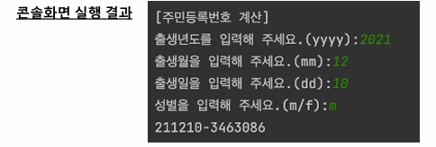
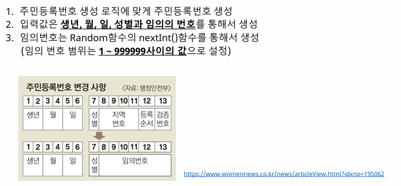

풀이
```java
import java.util.Random;
import java.util.Scanner;

public class notepad2 {
    public static void main(String[] args) {
        Scanner sc = new Scanner(System.in);
        System.out.println("[주민등록번호 계산]");
        System.out.print("출생년도를 입력해 주세요.(yyyy): ");
        int year = sc.nextInt();

        System.out.print("출생월을 입력해 주세요.(mm): ");
        int month = sc.nextInt();

        System.out.print("출생일을 입력하세요: ");
        int day = sc.nextInt();
        sc.nextLine();

        System.out.print("성별을 입력해 주세요.(m/f): ");
        String gender = sc.nextLine();
```
우선은 보이는 부분을 입력받았다.  
이제 이 입력받은 정보를 토대로 주민번호를 생성하도록 작성해보자
```java
String yearstr = String.valueOf(year % 1000); //String타입으로 입력받는게 나중에 합쳐서 출력하기 편하다. year을 100으로 나누면 나머지는 뒤에 두자리만 남게 되고 이것을 String으로 변환시켜서 저장해준다
String monthstr = String.format("%02d", month);
        String daystr = String.format("%02d", day);
        //마찬가지로 달과 일도 입력받는데 이때 한자리수 일수도 있기때문에 format을 이용해서 2자리로 각각 변환하여 저장해준다.
int gendercode = 0;
        if (gender.equals("m")) {
            gendercode = 3;
        } else {
            gendercode = 4;
        }
        //성별에 따라 3이나 4가 나오게 세팅
        Random random = new Random();
        int randomNum = random.nextInt((999998)+1); // 랜덤의 nextInt는 0부터 n까지의 숫잔데 우리는 1부터 99999까지 필요하기때문에 999998+1로 맞춰준다. 그러면 1부터 999999까지.
System.out.println(yearstr + monthstr + daystr + " - " + gendercode + randomNum);
//최종적으로 양식에 맞게 출력되게끔 한다.
```
## 최종코드
```java
import java.util.Random;
import java.util.Scanner;

public class notepad2 {
    public static void main(String[] args) {
        Scanner sc = new Scanner(System.in);
        System.out.println("[주민등록번호 계산]");
        System.out.print("출생년도를 입력해 주세요.(yyyy): ");
        int year = sc.nextInt();

        System.out.print("출생월을 입력해 주세요.(mm): ");
        int month = sc.nextInt();

        System.out.print("출생일을 입력하세요: ");
        int day = sc.nextInt();
        sc.nextLine();

        System.out.print("성별을 입력해 주세요.(m/f): ");
        String gender = sc.nextLine();

        String yearstr = String.valueOf(year % 100);
        String monthstr = String.format("%02d", month);
        String daystr = String.format("%02d", day);

        int gendercode = 0;
        if (gender.equals("m")) {
            gendercode = 3;
        } else {
            gendercode = 4;
        }
        Random random = new Random();
        int randomNum = random.nextInt((999999)+1);
        System.out.println(yearstr + monthstr + daystr + " - " + gendercode + randomNum);

    }
}
```

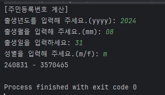
정상적으로 출력된다.

# 과제 5 달력 출력 프로그램
- 수행목적 : Scanner의 입력함수와 조건문 및 반복문을 통한 달력 계산 로직 작성
- 간략소개 :  달력은 일반적인 전산 시스템에서 많이 사용하는 컴포넌트 입니다.  입력받은 년도
와 월을 통해 달력을 출력하는 프로그램을 작성해보세요.

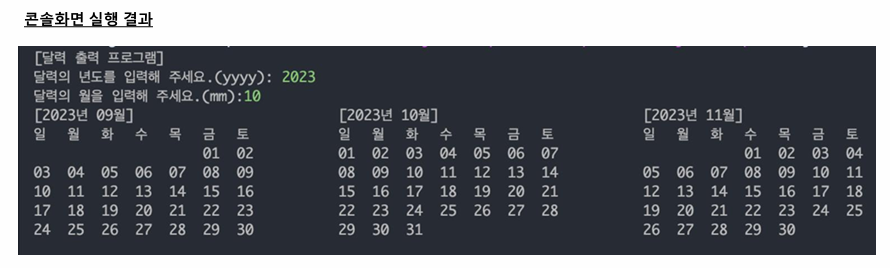
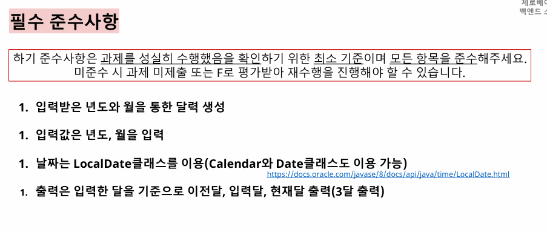

풀이과정  
Localdate타임 함수가 안써봤던거라 좀 오래걸렸다.  
하던대로 보이는 부분부터
```java
        Scanner sc = new Scanner(System.in);
        System.out.println("[달력 출력 프로그램]");
        System.out.print("달력의 년도를 입력해 주세요.(yyyy): ");
        int year = sc.nextInt();
        System.out.print("달력의 월을 입력해 주세요.(mm): ");
        int month = sc.nextInt();
        LocalDate curMonth = LocalDate.of(year, month, 1);
        LocalDate PreMonth = curMonth.minusMonths(1);
        LocalDate NexMonth = curMonth.plusMonths(1);
        //LocalDate of는 대입합 값의 따른 년도와 달을 변환해주는 메서드
        //minus,plus(month, year, day)는 기존에 입력된 LocalDate정보에 일정수만큼 년,달,일을 더하거나 빼준다.
```
그냥 입력하기엔 원체 답이 안보여서 달력을 만들어주는 기능은 메서드로 빼버렸다.
```java
public static void Calendar(LocalDate date) {//미리 만들어둔 로컬데이트를 입력받아서 처리
int year = date.getYear();
int month = date.getMonthValue();
//year은 그냥 겟할수있는데 달은 monthvalue를 써야된다. 중복되는 단어가 있어서 그런가

//해당 달의 첫번째 날과 마지막 날을 구한다.
LocalDate firstDay = LocalDate.of(year,month,1); // 해당 년/달의 1일
int lastDay = date.lengthOfMonth();
//익숙한 lenght. 길이=마지막 날
int dow =firstDay.getDayOfWeek().getValue(); // getDayOfWeek은 해당 날짜의 요일을 구하는 메서드다. 처음엔 이걸로 어떻게 해볼려고했는데 잘 안되서 이것을 정수로 바꿔줘서 저장했다(getValue)
System.out.println("["+year+"년 "+month+"월]");
System.out.println("일  월   화  수  목   금  토");
//만들어둔 year과 month를 이용해 표의 윗부분을 구축 간격맞추기가 어려웠다.
for (int i = 0; i < dow%7; i++) {
    System.out.print("    ");
    }
//요일을 int형으로 바꿔준 이유이다. 해당 달의 첫번째 날짜가 일요일이라는 보장이 없으므로 1일 이전의 요일엔 공백을 채워줘야한다.
//처음엔 dow만을 조건으로 했더니 dow가 토요일(7)이 되면 맨 윗줄을 통째로 비워버리기 때문에 dow%7로 조건을 수정했다.
for (int i = 1; i <= lastDay ; i++) {
    System.out.printf("%02d\t", i);
//그리고 마지막 날짜까지 day를 출력하되 
if((dow+i)%7==0){
    System.out.println();
} //맨처음 공백과 day(i)를 포함해서 7일마다 줄바꿈을 해줘야한다.
// 처음엔 i만 7로 나눴더니 그냥 위에서부터 7일씩 끊어버려서 실패
        }
        System.out.println();
        //출력이 끝났으면 한칸띄어서 구분해준다.
    }
}
```
### 최종코드
```java
import java.time.LocalDate;
import java.util.Scanner;

public class notepad2 {
    public static void main(String[] args) {
        Scanner sc = new Scanner(System.in);
        System.out.println("[달력 출력 프로그램]");
        System.out.print("달력의 년도를 입력해 주세요.(yyyy): ");
        int year = sc.nextInt();
        System.out.print("달력의 월을 입력해 주세요.(mm): ");
        int month = sc.nextInt();
        LocalDate curMonth = LocalDate.of(year, month, 1);
        LocalDate PreMonth = curMonth.minusMonths(1);
        LocalDate NexMonth = curMonth.plusMonths(1);
        Calendar(PreMonth);
        Calendar(curMonth);
        Calendar(NexMonth);
    }
    public static void Calendar(LocalDate date){
        int year = date.getYear();
        int month = date.getMonthValue();
        LocalDate firstDay = LocalDate.of(year,month,1);
        int lastDay = date.lengthOfMonth();
        int dow =firstDay.getDayOfWeek().getValue();
        System.out.println("["+year+"년 "+month+"월]");
        System.out.println("일  월   화  수  목   금  토");
        for (int i = 0; i < dow%7; i++) {
            System.out.print("    ");
        }
        for (int i = 1; i <= lastDay ; i++) {
            System.out.printf("%02d\t", i);
            if((dow+i)%7==0){
                System.out.println();
            }
        }
        System.out.println();
    }
}
```

※ 익숙하지 않은 함수였기 때문에 시간이 꽤 오래걸렸다. 지식이 늘었다.

# 과제 6 가상 선거 및 당선 시뮬레이션 프로그램
- 수행목적 : 조건문 및 반복문과 배열(or 컬렉션)을 통한 당선 시뮬레이션 로직 작성
- 간략소개 :  민주주의에서 선거를 대단히 중요한 의사표현입니다. 
이런 선거를 미리 시뮬레이
션을 통해서 진행하는 프로그램을 만들어보고자 합니다. 전체
 투표수와 후보자를 입력 받아서
 그 결과를 
미리 확인하는  선거 및 당선 시뮬레이션 프로그램을 만들어보세요.

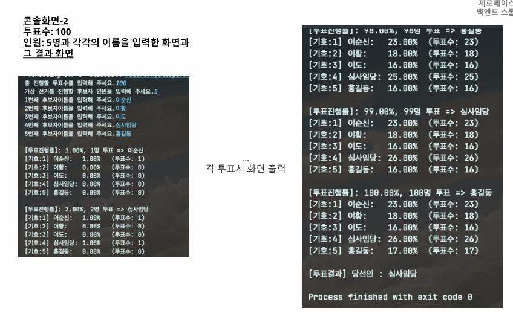
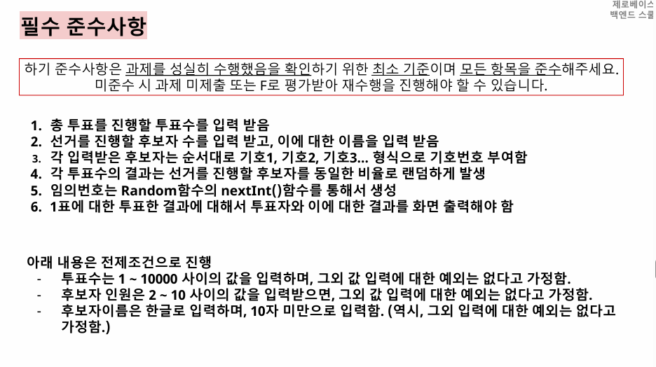

우선은 하던대로 눈에 보이는 부분을 작성한다
```java
    public static void main(String[] args) {
        Scanner sc = new Scanner(System.in);
        Random random = new Random();
        System.out.print("총 진행할 투표수르르 입력해주세요. ");
        int totalvote = sc.nextInt();

        System.out.print("가상 선거를 진행할 후보자 인원을 입력해 주세요. ");
        int candidateNum = sc.nextInt();
        sc.nextLine();

        String[] candidateName = new String[candidateNum];
        for (int i = 0; i <candidateNum ; i++) {
            System.out.print((i+1)+"번째 후보자 이름을 입력해 주세요. ");
            candidateName[i]=sc.nextLine();
        }
```
이후 한명이 투표할때마다 그 퍼센테이지, 몇명이 투표했는지, 누구를 투표했는지를 출력하며, 거기에 기호와 이름, 개별 퍼센테이지와 백문율, 투표수도 출력해줘야한다.  
for문이 한번돌 때마다 출력해야할 양이 상당하다.
```java
int[] voteResult = new int[candidateNum];
//후보자 인원수만큼의 배열을 만들어준다. 여기에 각 인원수별로 투표받은 숫자를 저장해줄것이다.
 for (int i = 1; i <=totalvote; i++) { //for문은 총 투표수만큼 반복한다.
            int vote = random.nextInt(candidateNum); 
            //변수를 하나 만들어서 인원수만큼의 숫자 중 하나를 뽑아 저장한다.
            voteResult[vote]++; // 기호vote번에 투표수를 하나 저장하는 방식으로 투표수만큼 반복하여 각 후보자에 투표수를 누적한다
이후에는 투표진행률을 출력하는 코드
System.out.printf("[투표진행률]: %.2f%%, %d명 투표 => %s\n"
                    ,(double)i/totalvote*100,i,candidateName[vote]);
        //투표율을 표시한다. 비율, 투표 수, 누적되는 후보 이름 순이다. 소숫점이기에 표현식은 int가 아닌 double이나 float로 받아준다.
            for (int j = 0; j < candidateNum; j++) {
                System.out.printf("기호:%d] %s:\t%.2f%%\t(투표수: %d)\n",
                        (j+1),candidateName[j],(double) voteResult[j]/totalvote*100,voteResult[j]);
            //아랫쪽은 개별투표수를 출력하는 코드로 j가 0부터 시작이기에 +1해주는 것을 잊지말고 출력 예시에 맞게 포맷을 작성하자.
            }
 }
  System.out.println(""); //줄 띄우기
```
이제 각 투표수를 비교하여 최다득표한 인원을 찾아 당선인으로 출력하면된다.
```java
int maxVote = 0;//최다 득표수 확인용
int elected = 0;//당선 기호 확인용
    for (int i = 0; i < candidateNum; i++) { //후보인원수만큼 반복하며 서로 비교
        if(voteResult[i]>maxVote){ //최다득표수와 각 후보의 득표수를 비교하여
            maxVote=voteResult[i]; // 최다득표수를 갱신해주고
            elected=i; // 최다득표한 인원의 기호를 대입한다.
        }
    }
System.out.println("[투표결과] 당선인 : "+candidateName[elected]); //후보 중에 최다득표한 인원의 이름을 출력한다.
```
최종코드
```java
import java.util.Random;
import java.util.Scanner;

public class notepad2 {
    public static void main(String[] args) {
        Scanner sc = new Scanner(System.in);
        Random random = new Random();
        System.out.print("총 진행할 투표수르르 입력해주세요. ");
        int totalvote = sc.nextInt();

        System.out.print("가상 선거를 진행할 후보자 인원을 입력해 주세요. ");
        int candidateNum = sc.nextInt();
        sc.nextLine();

        String[] candidateName = new String[candidateNum];
        for (int i = 0; i <candidateNum ; i++) {
            System.out.print((i+1)+"번째 후보자 이름을 입력해 주세요. ");
            candidateName[i]=sc.nextLine();
        }

        int[] voteResult = new int[candidateNum];
        for (int i = 1; i <=totalvote; i++) {
            int vote = random.nextInt(candidateNum);
            voteResult[vote]++;
            System.out.printf("[투표진행률]: %.2f%%, %d명 투표 => %s\n"
                    ,(double)i/totalvote*100,i,candidateName[vote]);
            for (int j = 0; j < candidateNum; j++) {
                System.out.printf("기호:%d] %s:\t%.2f%%\t(투표수: %d)\n",
                        (j+1),candidateName[j],(double) voteResult[j]/totalvote*100,voteResult[j]);
            }
 }
        System.out.println("");
        int maxVote = 0;
        int elected = 0;
        for (int i = 0; i < candidateNum; i++) {
            if(voteResult[i]>maxVote){
                maxVote=voteResult[i];
                elected=i;
            }
        }
        System.out.println("[투표결과] 당선인 : "+candidateName[elected]);
    }
}
```
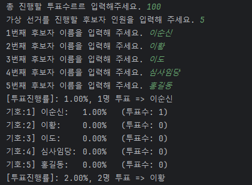  
.  
 .  
 .  
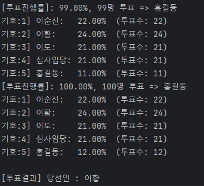

정상출력됨을 확인할 수 있다.
반복문과 스트링 포맷, 조건식을 잘 활용하면 어렵지 않게 풀 수 있었다.

# 과제 7 로또 당첨 프로그램

- 수행목적 : Scanner의 입력함수와 조건문 및 반복문과 배열을 통한 로또당첨 로직 작성
- 간략소개 : 로또는 1-45개의 숫자 사이의 값 중 6개를 맞추면 당첨되는 복권 입니다. 로또의 개
수를 구매하고(구매수량입력), 당첨번호를 생성한다. 이후, 구매한 로또의 당첨번호를 판단하
는 프로그램을 작성해보세요.

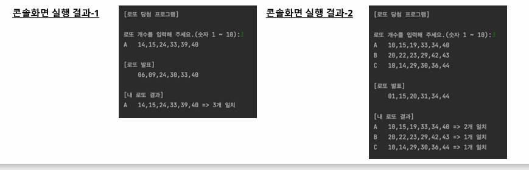
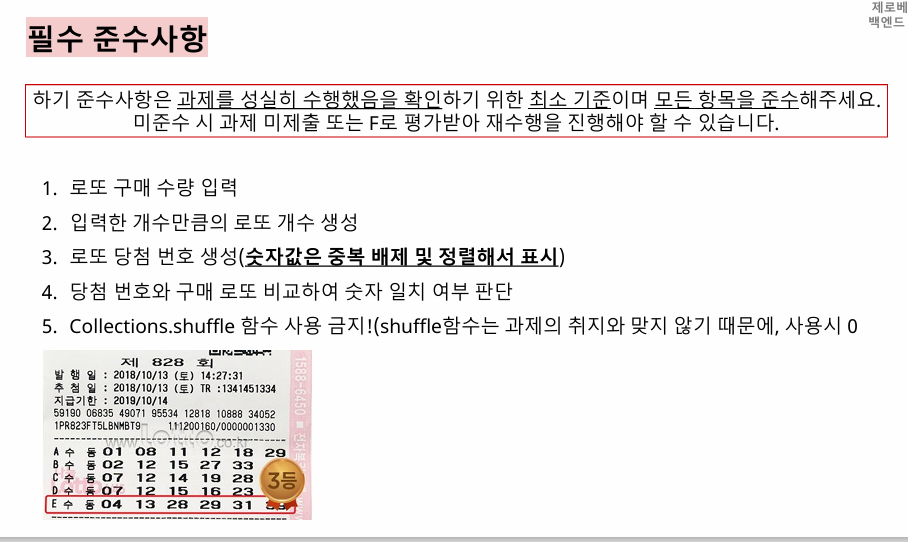

<strong>6개의 숫자가 적힌 배열을 1~10개만큼 생성</strong>하며 6개짜리 당첨 번호를 추가로 생성하여 <strong>이미 생성된 번호와 비교</strong>하여 <strong>몇개가 일치하는지 확인</strong>한다

하던대로 보이는 부분을 구현
```java
Scanner sc = new Scanner(System.in);
System.out.println("[로또 당첨 프로그램]\n");
System.out.print("로또 개수를 입력해 주세요.(숫자 1 ~ 10):");
int lottoNum = sc.nextInt();
int[][] lottoticket = new int[lottoNum][6];//입력한 갯수만큼 길이가6짜리 2차원배열을 생성한다.
```
이후 코드 작성과정에서 숫자 6개짜리 배열을 만드는 과정에서 코드가 길어지기도 하고 추후 당첨 번호도 작성해야하는 이유로 숫자 6개짜리 배열을 만드는 코드는 메서드로 빼버렸다.
```java
public static int[] creatLnumber(Random rd) {
        int[] ticketNum = new int[6];//숫자는 총 6개
        int order = 0;//숫자의 위치를 나타내는 용이다
        while (order < 6) {// 위치가 6이되면 while문 종료
            int num = rd.nextInt(45) + 1;//숫자는 1~45까지이므로 +1을 해줘야한다
            if (!contain(ticketNum, num)) {//작성을 하다보니 6개의 배열중에 중복되는 숫자가 나올 가능성도 고려해야했다. 이것또한 메서드로 빼는 편이 더 좋을 것이라 판단, contain이라는 메서드를 추가하기로 했다.
                ticketNum[order++] = num; //중복을 체크하여 중복되지 않았다면 각 배열에 해당 숫자를 추가한다.
            }
        }
        return ticketNum; //마지막으로 추가된 6개짜리 숫자배열을 리턴
}

public static boolean contain(int[] lottoticket, int num) {//중복체크해줘야했다. 배열에 들어갈 숫자로.
        for (int n : lottoticket) {//로또티켓만큼 반복하는데 
            if (n == num) {//해당배열에 있는 숫자가 입력받은 숫자와 같은지 판단하여
                return true; //같다면 true를
            }
        }
        return false; // 틀리다면 false를 리턴한다.
즉 !contain(ticketNum, num)에서 숫자가 중복되지 않으면 false가 되고 !false는 true니까 중복되지 않음으로 판단하여 각 order++번째 배열에 숫자가 대입되는 것이다.
```
다시main문으로 돌아와서 해당 메서드들을 통해 입력받은 숫자만큼의 로또 번호를 출력하게 구현해준다.
```java
System.out.println("[로또 당첨 프로그램]\n");
        System.out.print("로또 개수를 입력해 주세요.(숫자 1 ~ 10):");
        int lottoNum = sc.nextInt();
        int[][] lottoticket = new int[lottoNum][6];
        for (int i = 0; i < lottoNum; i++) {
            lottoticket[i] = creatLnumber(rd);//i번째 티켓에 로또번호 생성
            for (int j = 0; j < 6; j++) {//번호는 6개니까 6번반복
            //Arrays.toString을 쓰면 간단하게 출력할 수 있으나 해당 과제에선 [와 ]가 포함되지 않고 출력되고있다. 때문에 반복문을 사용해서 출력토록한다.
                System.out.printf("%02d", lottoticket[i][j]);
                if (j < 5) {
                    System.out.print(",");//마지막 숫자 이후엔 ,가 출력될 필요가 없으니 if를 하나 추가해준다.
                }
            }
            System.out.println("");
        }
```
문제가 하나있다.  
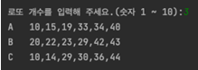  
각 로또번호의 출력 앞을 보면 A부터 시작되는 알파벳이 있다. 숫자를 쓰면 간단하겠지만 알파벳이라 골치가 아파졌다.  
거기서 생각해낸게 char를 이용해 문자하나를 추가해주는 방법이었다.  
char cnt='A'이고 로또 갯수만큼 반복할때 여기에+1을 해주면 유니코드 입력법칙에 따라 알파벳이 하나 씩 바뀔것이다.  
이것을 토대로 main문을 수정한다.
```java
 Scanner sc = new Scanner(System.in);
        Random rd = new Random();
        char cnt = 'A';
        System.out.println("[로또 당첨 프로그램]\n");
        System.out.print("로또 개수를 입력해 주세요.(숫자 1 ~ 10):");
        int lottoNum = sc.nextInt();
        int[][] lottoticket = new int[lottoNum][6];
        for (int i = 0; i < lottoNum; i++) {
            lottoticket[i] = creatLnumber(rd);
            System.out.print(cnt + "\t");//처음엔 "A    "으로 출력되고
            for (int j = 0; j < 6; j++) {
                System.out.printf("%02d", lottoticket[i][j]);
                if (j < 5) {
                    System.out.print(",");
                }
            }
            System.out.println("");
            cnt++;//반복문 한번에 cnt를 1씩 추가해주면 그다음 cnt는 'B','C'....순서로 바뀔것이다.
        }
```
이후에는 당첨번호를 만들어서 출력한 후에 이것과 이전에 작성된 번호끼리 중복되는 숫자를 카운트해서 표시해줘야한다.
```java
중복되는 숫자를 찾는 메서드를 작성
 public static int matchCnt(int[] creatT,int[] winningT){
        int cnt = 0;
        for (int m1 : creatT){
            for(int m2 : winningT) {//각각의 6개의 번호를 모두 비교하여
                if(m1 == m2) {
                    cnt++; //일치하는 숫자가 있다면 카운트를 하나올려주고
                }
            }
        }
        return cnt; //마지막에 이 카운트를 리턴해준다.
    }
```
해당코드를 취합하여 최종적으로 작성한 코드는 다음과 같다.
```java
import java.util.Random;
import java.util.Scanner;

public class notepad2 {
    public static void main(String[] args) {
        Scanner sc = new Scanner(System.in);
        Random rd = new Random();
        char cnt = 'A';
        System.out.println("[로또 당첨 프로그램]\n");
        System.out.print("로또 개수를 입력해 주세요.(숫자 1 ~ 10):");
        int lottoNum = sc.nextInt();
        int[][] lottoticket = new int[lottoNum][6];
        for (int i = 0; i < lottoNum; i++) {
            lottoticket[i] = creatLnumber(rd);
            System.out.print(cnt + "\t");
            for (int j = 0; j < 6; j++) {
                System.out.printf("%02d", lottoticket[i][j]);
                if (j < 5) {
                    System.out.print(",");
                }
            }
            System.out.println("");
            cnt++;
        }
        cnt ='A'; //아래에 일치갯수를 출력하는 코드에서 cnt를 재사용하기 때문에 cnt를 다시 A로 초기화해줘야한다. 그렇지않으면 위에 적었던 마지막 알파벳에서 이어서 출력될것이기 때문에
        System.out.println("");

        int[] winticketNum = creatLnumber(rd);

        System.out.println("[로또 발표]");
        System.out.print(" \t");
        for (int i = 0; i < 6; i++) {
            System.out.printf("%02d", winticketNum[i]);
            if (i < 5) {
                System.out.print(",");
            }
        }
        System.out.println("");
        System.out.println("[내 로또 결과]");
        for (int i = 0; i < lottoNum; i++) {
            System.out.print(cnt + "\t");
            for (int j = 0; j < 6; j++) {
                System.out.printf("%02d", lottoticket[i][j]);
                if (j < 5) {
                    System.out.print(",");
                }
            }
            int match = matchCnt(lottoticket[i],winticketNum);
            System.out.printf(" => %d개 일치\n",match);
            cnt++;
        }
    }


    public static int[] creatLnumber(Random rd) {
        int[] ticketNum = new int[6];
        int order = 0;
        while (order < 6) {
            int num = rd.nextInt(45) + 1;
            if (!contain(ticketNum, num)) {
                ticketNum[order++] = num;
            }
        }
        return ticketNum;
    }

    public static boolean contain(int[] lottoticket, int num) {
        for (int n : lottoticket) {
            if (n == num) {
                return true;
            }
        }
        return false;
    }

    public static int matchCnt(int[] creatT,int[] winningT){
        int cnt = 0;
        for (int m1 : creatT){
            for(int m2 : winningT) {
                if(m1 == m2) {
                    cnt++;
                }
            }
        }
        return cnt;
    }
}
```

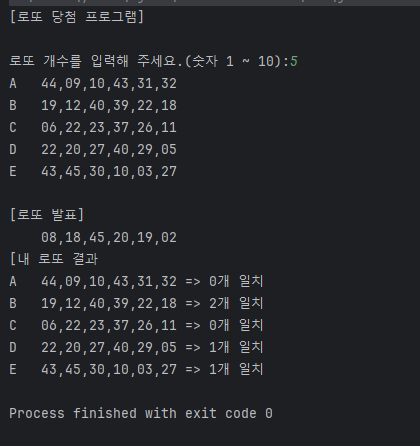  

- 예제의 출력부와 일치하는 결과값이 나왔다.
# 과제 8 연소득 과세금액 계산 프로그램
- 수행목적 : Scanner의 입력함수와 조건문 및 반복문과 배열, 함수를 통한 과세 로직 작성
- 간략소개 : 대한민국헌법은 국민의 의무와 권리를 규정하고 있습니다. 이 중 납세의 의무는 국
민의 3대 의무 중 하나입니다. 모든 국민은 1년동안 열심히 번 소득에 대해서 세금을 납부하여
야 합니다. 이런 소득에 대한 소득세율표가 있습니다. 주어진 표를 기준으로해서 소득에 대한
 세금을 구하는 프로그램을 작성해보세요.


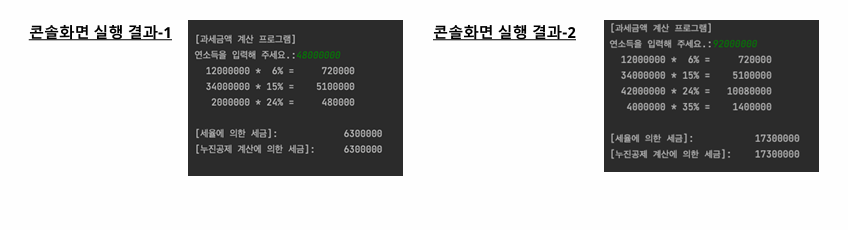 
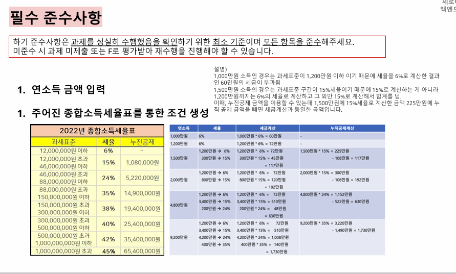 

※ 어렵다....겁나게 어렵다... 코드가 길어질 것같아서 세율을 계산하는 부분은 처음부터 메서드로 빼버렸으며 우선 보이는부분부터 입력해주기로했다.
```java
 Scanner sc = new Scanner(System.in);
        System.out.println("[과세금액 계산 프로그램]");
        System.out.print("연소득을 입력해 주세요:");
        int income = sc.nextInt();
```
당장에 해결할 수 있는 부분은 이게 다였다.  
이제 메서드로 뺀 부분에서 종합소득세율표를 보고 알 수 있는 정보들을 하나씩 기입하기로 했다.
```java
int[] taxation = {12000000, 46000000, 88000000, 150000000, 300000000, 500000000, 1000000000}; //과세표준에 따라 과세 배열을 만들어주고
int[] taxRate = {6, 15, 24, 35, 38, 40, 42, 45}; //세율 배열
int[] deductions = {0, 1080000, 5220000, 14900000, 19400000, 25400000, 35400000, 65400000}; //누진공제 배열

int remain = income; //※1

int totalTax = 0; //세율에 의한 세금의 최종값을 저장해줄 녀석

for (int i = 0; i < taxation.length; i++) { //과세만큼 반복해준다.
if (income <= taxation[i]) {//입력한 수가 과세배열의 해당수치와 비교하셔 같거나 작을경우
                int taxable = remain; //계산과정에서 income하나로 계산이 복잡해져서 income값을 저장해서 계산할 변수를 따로 하나 추가하였다. ※1
                int calculated = taxable * taxRate[i] / 100; // income에서 세율만큼 곱해서 나온 세금을 저장하며
                totalTax += calculated; //이것을 세금 최종값에 저장한다.
                System.out.printf("%10d * %2d%% = %10d\n", taxable, taxRate[i], calculated); //그리고 이것을 포멧을 맞춰서 예제처럼 출력한다.
```
이때 세율에 의한 세금을 계산하는 과정에 이런 설명이 덧붙여져있다.
- 1,000만원소득인 경우는 과세표준이 1,200만원 이하이기 때문에 세율을 6%로 계산한 결과
인 60만원의 세금이 부과됨
- 1,500만원 소득의 경우는 과세표준 구간이 15%세율이기 때문에 15%로 계산하는게 아니라  
  1,200만원까지는 6%의 세율로 계산하고 그 외만 15%로 계산해서 합계를냄. 

  
- 즉 수입이 4800만원이라면 4600만원을 초과한 200만원에 대해서는 24퍼센트의 세율을 부과하고
- 1200만원부터 4600만원까지의 3400만원은 15퍼센트의 세율을 부과하며
- 나머지 1200만원에 대해서는 6퍼센트의 세율을 부과한다는 의미다  
  ~~뭔개소리냐 진짜~~
- 요컨데 반복문이 반복되는동안 위 코드 이외에 추가조건을 줘서 각 세율 부분에 대한 계산을 세분화해줘야한다는 의미다.

```java
for (int i = 0; i < taxation.length; i++) {
            if (income <= taxation[i]) {
                int taxable = remain;
                int calculated = taxable * taxRate[i] / 100;
                totalTax += calculated;
                System.out.printf("%10d * %2d%% = %10d\n", taxable, taxRate[i], calculated);
                break;
그래서 추가된 부분이 아래 else부분
            } else {
                int taxable = taxation[i] - (i > 0 ? taxation[i - 1] : 0);
                i가 0일 때는 해당부분이 없이 if문의 첫번째만 구하고 끝나겠지만
                i가 1이상이라면 taxation[i-1]과 0중에서 큰값(무조건 taxation[i-1])를
                i번째 과세에서 빼준 값을 집어넣어 계산하게 된다. 

                int calculated = taxable * taxRate[i] / 100;
                totalTax += calculated; //계산값을 최종 세금에 더해준 후에
                remain -= taxable; //계산한만큼의 값을 빼주고 
                System.out.printf("%10d * %2d%% = %10d\n", taxable, taxRate[i], calculated); // 계산한 분량을 출력해준다
            }
        }
```
- 이렇게 코드를 작성하고 4800만원 Test Case를 대입해보자.
  - i가 0이면 else부분이 실행되어 1200만원에 대한 세금을 계산하고(72만원) 4800만원에서 1200만원을 빼준다. remain = 3600만원
  - i가 1이면 마찬가지로 else부분이 실행, 3400만원에 대한 세금을 계산(510만원) 후 3600만원에서 3400만원을 빼준다. remain = 200만원
  - i가 2이면 if부분이 실행되어 200만원에 대해 세율 24퍼센트의 계산을 실행하여 totalTax에 더해지며 break를 만나 계산이 종료된다.

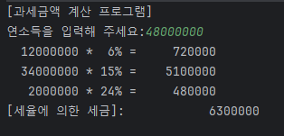  
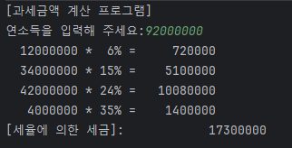  

세율에 의한 세금 계산은 정상적으로 처리된다.  
다음에 구해야 하는 부분은 누진공제 계산에 의한 세금이다.
```java
        int totalTax2 = 0;
        for (int i =taxation.length-1; i>=0; i--) {
            if (income > taxation[i]) {
                totalTax2 =income * taxRate[i+1] / 100 - deductions[i+1];
                break;
            }
        }
```
계산이 간단한만큼 코드가 간단한데 유의할 점이 있다면 i가 0부터 시작하는 ++반복문이었다면 설정범위오류가 나기때문에 과세의 마지막부분부터 시작해서 반대로 내려가는 --반복문을 사용하였다.
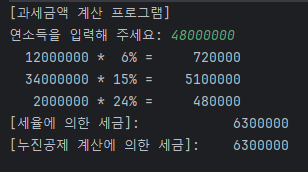   
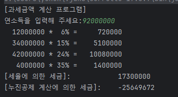   

??? 테스트케이스 1번은 정상적으로 출력되나 2번은 음수가 나온다.  
디버그 모드를 사용해서 체크해봐도 정상적으로 값을 가져왔으나 마지막 계산에서 갑자기 음수를 뱉어버린다.

그 이유는 9200만을 입력했을 때 계산식이 처리되는 과정에서 int형 정수가 표현할 수 있는 한계를 넘어서 오버플로우가 발생한 것인데 int가 아닌 더 큰 수를 표현할 수 있는 표현식을 넣어주면 해결된다.


```java
        long totalTax2 = 0;
        for (int i =taxation.length-1; i>=0; i--) {
            if (income > taxation[i]) {
                totalTax2 =(long)income * taxRate[i+1] / 100 - deductions[i+1];
                break;
            }
        }
```
누진공제 계산에 의한 최종 세금을 저장한 변수 totalTax2를 long형으로 바꿔주어 최종적으로 작성한다.

## 최종코드
```java
import java.util.Scanner;

public class notepad2 {
    public static void main(String[] args) {
        Scanner sc = new Scanner(System.in);
        System.out.println("[과세금액 계산 프로그램]");
        System.out.print("연소득을 입력해 주세요:");
        int income = sc.nextInt();
        calculIncome(income);

    }

    public static void calculIncome(int income) {
        int remain = income;
        int[] taxation = {12000000, 46000000, 88000000, 150000000, 300000000, 500000000, 1000000000};
        int[] taxRate = {6, 15, 24, 35, 38, 40, 42, 45};
        int[] deductions = {0, 1080000, 5220000, 14900000, 19400000, 25400000, 35400000, 65400000};

        int totalTax = 0;
        for (int i = 0; i < taxation.length; i++) {
            if (income <= taxation[i]) {
                int taxable = remain;
                int calculated = taxable * taxRate[i] / 100;
                totalTax += calculated;
                System.out.printf("%10d * %2d%% = %10d\n", taxable, taxRate[i], calculated);
                break;
            } else {
                int taxable = taxation[i] - (i > 0 ? taxation[i - 1] : 0);
                int calculated = taxable * taxRate[i] / 100;
                totalTax += calculated;
                remain -= taxable;
                System.out.printf("%10d * %2d%% = %10d\n", taxable, taxRate[i], calculated);
            }
        }
        long totalTax2 = 0;
        for (int i =taxation.length-1; i>=0; i--) {
            if (income > taxation[i]) {
                totalTax2 =(long)income * taxRate[i+1] / 100 - deductions[i+1];
                break;
            }
        }
        System.out.println("[세율에 의한 세금]:\t\t\t" + totalTax);
        System.out.println("[누진공제 계산에 의한 세금]:\t" + totalTax2);
    }
}
```
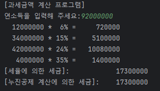  

출력결과도 이상없이 정상적으로 출력되는 것을 볼 수 있다.

※ 세율 계산자체가 복잡하여 코드를 구현하는데 시간이 오래걸리는 문제였다.