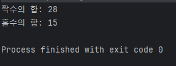
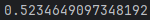
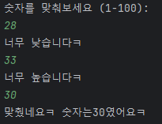
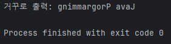
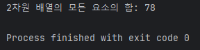

240115
# 과제1 : 짝수와 홀수의 합 계산
- 목표 : 주어진 배열에서 모든 짝수와 홀수의 합을 각각 계산하는 코드를 작성하라.
- 요구사항 : 다음 코드를 완성시켜서 주어진 출력 결과를 만들어내라.
```java
public class SumEvenOdd {
    public static void main(String[] args) {
        int[] arr = { 10, 3, 4, 7, 5, 6, 8 };
        int sumEven = 0;
        int sumOdd = 0;

        // 코드를 작성

        System.out.println("짝수의 합: " + sumEven);
        System.out.println("홀수의 합: " + sumOdd);
    }
}
```
```
출력 결과

짝수의 합: 28
홀수의 합: 15
```
## 풀이
간단한 for과 조건문 하나로 풀 수 있다.
```java
for (int i = 0; i < arr.length; i++) {
        if(arr[i]%2==0) {
                sumEven+=arr[i];
            }
            else {
                sumOdd+=arr[i];
            }
        }
```
배열의 길이만큼 for문을 반복하며 arr의 i번째 배열의 값을 2로 나눴을때 나머지 0이면 짝수(Even)에 그렇지 않으면 홀수(Odd)에 더해지게 만들어주면 된다.



# 과제2 : 숫자 맞추기 게임
- 목표 : 사용자가 컴퓨터가 생각한 숫자를 맞추는 간단한 게임을 작성하라.
- 요구사항 : 다음 코드를 완성시켜서 게임을 실행하라.  
```java
Math.random() : : 0.0 이상 1.0 미만의 임의의 실수를 반환하는 함수
``` 
```java
import java.util.Scanner;

public class GuessNumberGame {
    public static void main(String[] args) {
        int secretNumber = (int) (Math.random() * 100) + 1;
        Scanner scanner = new Scanner(System.in);

        System.out.println("숫자를 맞춰보세요 (1-100):");

        // 코드를 작성

        scanner.close();
    }
}
```
출력예제
```
숫자를 맞춰보세요 (1-100):
50
너무 낮습니다!
75
너무 높습니다!
62
맞췄습니다! 숫자는 62였습니다!
```
위에 쓰인 데로 Math.random() 함수는 0.0 ~ 1.0 미만의 실수가 나온다.  



여기에 int형으로 받고 *10 해주면 한자리 랜덤한 정수가 되고, *100을 해주면 두자리의 랜덤한 정수가 되는 것이다.  
때문에 문제에 (Math.random() * 100)는 두자리의 랜덤한 정수가 되며 1을 더해준 이유는 100도 정답이 될 수 있기 때문이다(그냥 100만 곱하면 최대값이 99기 때문에).

해당 문제는 while문을 사용하여 해당 숫자를 맞출때까지 반복하는 방법이 제일 좋은 것 같다.
```java
 while (true) {///우리가 boolean값을 false로 리턴하거나 break를 하기전까지 무한 반복한다 
int num = scanner.nextInt();//우리가 입력한 수를 받아줄 변수하나를 만든다. nextInt는 정수형의 숫자를 받는것을 말한다
 if (num < secretNumber) {
        System.out.println("너무 낮습니다!");
        } else if (num > secretNumber) {
        System.out.println("너무 높습니다!");
        } else { //eles if를 사용하여 낮은지 높은지를 체크해주고 낮지도 높지도 않다면 그것이 정답일 테니 else에는 정답을 맞췄을때 출력될 문구를 작성한다.
        System.out.println("맞췄습니다! 숫자는" + secretNumber + "였습니다!");
        break;//break를 해주지 않으면 정답을 맞췄음에도 무한 반복된다.
    }
 }
 ```
  
정상적으로 출력되는것을 볼 수 있다.

# 과제3 : 문자열 거꾸로 출력하기
- 목표 : 주어진 문자열을 거꾸로 출력하는 코드를 작성하라.
- 요구사항 : 다음 코드를 완성시켜서 주어진 출력 결과를 만들어내라.
```java
public class ReverseString {
    public static void main(String[] args) {
        String original = "Java Programming";
        String reversed = "";

        // 코드를 작성

        System.out.println("거꾸로 출력: " + reversed);
    }
}
```
출력결과
```
거꾸로 출력: gnimmargorP avaJ
```
평소에 쓰던 for문의 응용이 필요하다.
```java
        for (int i = original.length()-1; i>=0; i--) {//i를 original의 마지막부터 첫번째까지 거꾸로 그 값을 읽어온다. for문 안에 입력되는 조건은 생각보다 자유롭게 사용할 수 있다.
            reversed = reversed + original.charAt(i);
            //charAt(i)는 문자열의 i번째 문자의 값을 가져오는 메서드로 original(i)는 에러가 뜨기 때문에 charAt을 써줘야한다.
        }
```
```java
public class ReverseString {
    public static void main(String[] args) {
        String original = "Java Programming";
        String reversed = "";
        for (int i =original.length()-1; i>=0; i--) {
            reversed +=original.charAt(i);
        }

        System.out.println("거꾸로 출력: " + reversed);
    }
}
```
완성하면 이런 코드가 되며  
  
정상적으로 출력되는 것을 볼 수 있다.  
※ original.length에서 -1을 해주는 이유는 배열의 첫번째는 0부터 시작하기 때문!

# 과제4 : 2차원 배열의 합 구하기
- 목표 : 2차원 배열의 각 요소의 합을 구하는 코드를 작성하라.
- 요구사항 : 다음 코드를 완성시켜서 주어진 출력 결과를 만들어내라.
```java
public class Sum2DArray {
    public static void main(String[] args) {
        int[][] arr = { { 1, 2, 3 }, { 4, 5, 6 }, { 7, 8, 9 }, { 10, 11, 12 } };
        int sum = 0;

        // 코드를 작성

        System.out.println("2차원 배열의 모든 요소의 합: " + sum);
    }
}
```
출력결과
```
2차원 배열의 모든 요소의 합: 78
```
이중for문을 사용하면 간단하게 2차원배열의 모든 요소를 탐색할 수 있다.  
|a\b|1|2|3|
|---|---|---|---|
|1|1|2|3|
|2|4|5|6|
|3|7|8|9|
|4|10|11|12|

2차원 배열을 표로 만들면 이런 느낌인데 첫번째 for문은 가로를, 두번째 for문은 세로를 탐색하도록 만들어주면 쉽게 작성할 수 있다.
```java
public class Sum2DArray {
    public static void main(String[] args) {
        int[][] arr = { { 1, 2, 3 }, { 4, 5, 6 }, { 7, 8, 9 }, { 10, 11, 12 } };
        int sum = 0;

        for (int a = 0; a<arr.length; a++) {
            for (int b = 0; b<arr[a].length; b++) {
                sum += arr[a][b];
            }
        }
        System.out.println("2차원 배열의 모든 요소의 합: " + sum);
    }
}
```
  
정상적으로 출력된다.  
2중for문의 기본같은 문제였다