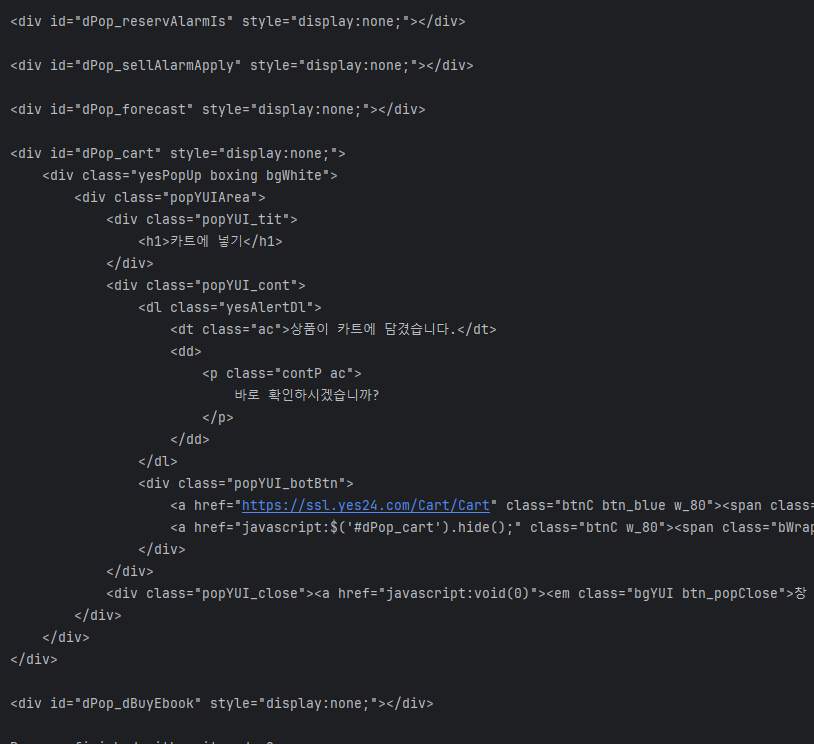
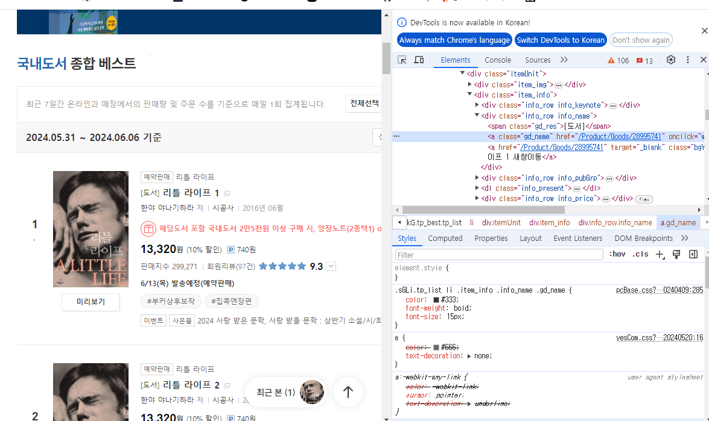
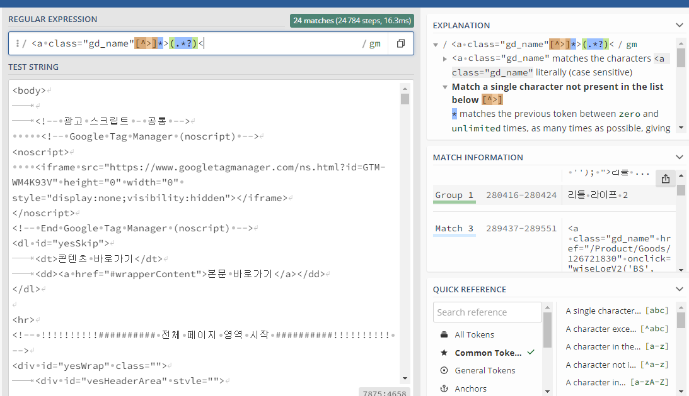
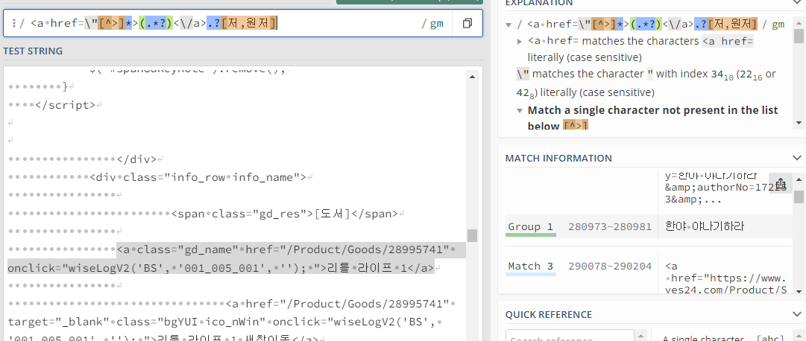
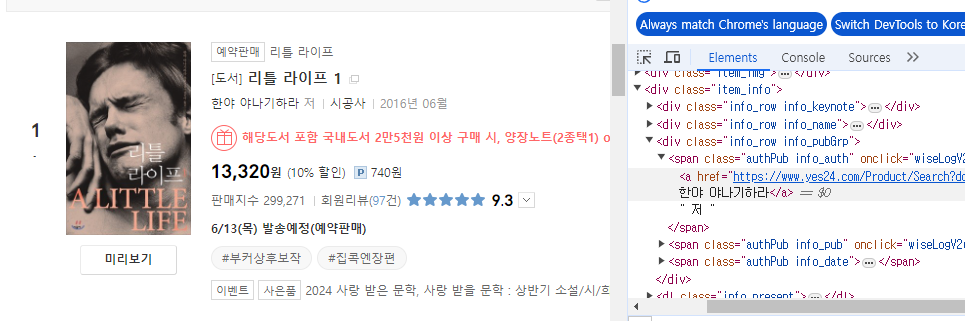
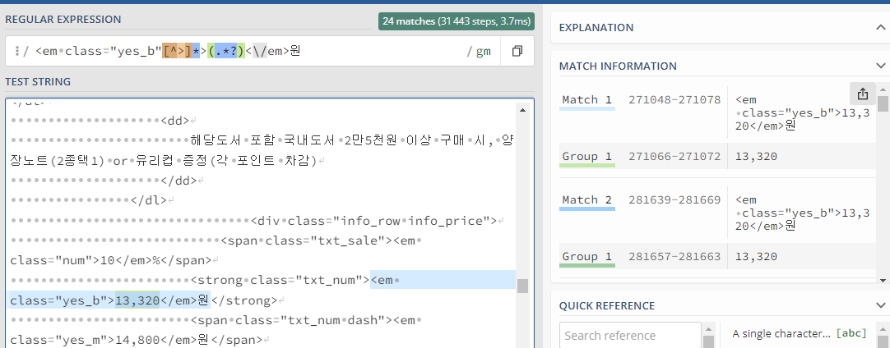
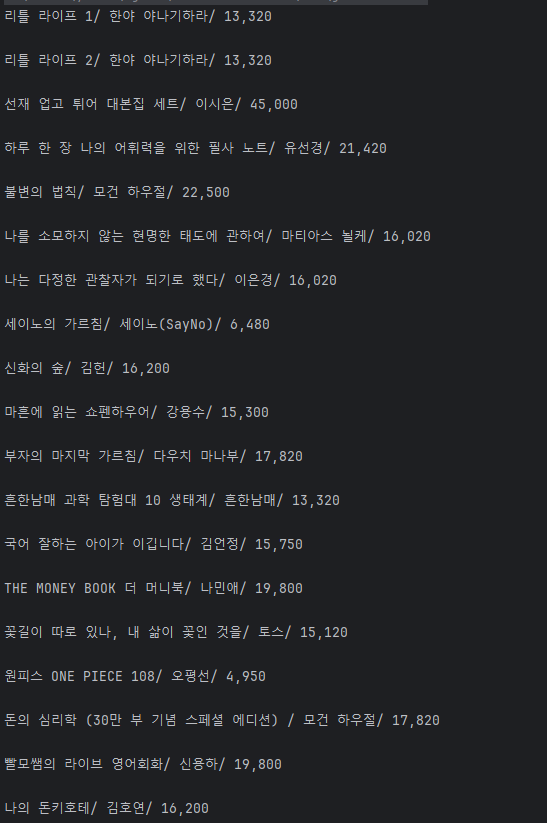

240604
# 웹 크롤러 구현
- 목표 : 웹 크롤러를 구현하여 웹 페이지의 정보를 수집하고, 이를 활용하여 웹 페이지를 분석하는 방법을 이해한다.
- 요구사함 :
Yes24의 베스트 셀러 링크로부터 제목, 저자, 가격 정보를 출력하는 웹 크롤러를 구현한다.

- Yes24의 베스트 셀러 링크는 다음과 같다.
  - https://www.yes24.com/Product/Category/BestSeller?categoryNumber=001&Gcode=000_002_012

링크의 html코드를 가져오는 코드는 지난 시간에 배운 거에서 사용한 예제코드를 긁어온다.

```java
public class crawler {
    public static void main(String[] args) throws IOException, InterruptedException {
        HttpClient client = HttpClient.newHttpClient();
        HttpRequest request = HttpRequest.newBuilder()
                .uri(URI.create("https://www.yes24.com/Product/Category/BestSeller?categoryNumber=001&Gcode=000_002_012")).build();
        HttpResponse<String> response = client.send(request, HttpResponse.BodyHandlers.ofString());
System.out.println("Response body: " + response.body());
    }
```

- 해당 링크에서 성공적으로 html을 가져오는것을 볼 수 있다.  
  이것을 이제 String에 저장해서 저장된 문자열을 가지고 제목과 저자, 가격을 찾아서 해당 정보만 출력할 수 있게 만들어 줄 것이다.
  이때 사용할 클래스가 Pattern과 Matcher이다.
  - Pattern은 정규표현식(REGEX)이 컴파일 된 클래스이다.
    - .compile함수를 사용해서 정규표현식을 집어넣어 문자열에서 매치되는 그룹을 찾아낸다.
    - 이것을 matcher()함수를 통해 Matcher쿨래스에 저장할 수 있다.
  - Matcher는 Pattern.complie로 찾아낸 문자열을 저장하는 함수라고 생각하면된다.
  - Pattern에 컴파일 할 정규포현식을 적어 특정문자열을 찾을 것이다.


도서의 제목을 나타내는 코드는 검사를 통해서 찾을 수 있다.  
정규표현식을 자바 내에서 계속 확인하기엔 한눈에 보고 판한하기 힘들기 때문에 외부 사이트를 쓴다.
https://regex101.com/

해당사이트에 링크의 body를 전부 긁어서 붙여넣어주고 찾아보겠다.

책의 제목을 찾아내는 REGEX는 다음과 같다
```html
<a class="gd_name"[^>]*>(.*?)<
```
<a class="gd_name" href]="/Product/Goods/28995741" onclick="wiseLogV2('BS', '001_005_001', ''); ">리틀 라이프 1<\/a>"
- 책의 제목을 나타내는 html코드는 전부 <a class="gd_name"로 시작했으므로 여기까지 입력.
- ^는 문자열의 시작부분을 나타내는데 []를 씌워서 사용하면 ^로 시작하지 않는다는 뜻인데,  
  [^>]이렇게 사용하면 >로 시작하지 않는 부분은 전부 무시한다는 의미로 보면된다.
- *>에서 *은 문자나 숫자가 특정길이만큼 있다는 뜻으로 *>는 >전에 몇개의 문자가 있음을 나타낸다.
- (.*?)< .은 한개의 문자를 *은 무제한의 문자나 숫자를 의미하며 ?는 앞에 있는 문자그룹과 일치하는데 이것을 합쳐보면 .*?는 >와 <사이에 있는 모든 특정문자를 검색해서 일치하는 것을 그룹화 한다는 의미이다.

```java
 String yes24 = response.body(); //html코드를 yes24라는 문자열에 저장한다.
 Pattern bookname = Pattern.compile("<a class=\"gd_name\"[^>]*>(.*?)<");
 //위 regex를 토대로 작성한 패턴을 컴파일해준다.
 Matcher bookout = bookname.matcher(yes24); // 해당정규식으로 yes24를 탐색할 결과같을 저장
while(bookout.find()) {
     System.out.println(bookout.group(1);
} //해당 Matcher를 통해 찾아낸(find()) 그룹을 출력하면...
```


이처럼 성공적으로 도서의 제목으르 크롤해왔다.  
마찬가지로 정규표현식을 바꿔보면서 가격과 저자도 찾아낸다.



- 정규식 뒤에 붙은[저, 원저]는 \<a=herf>로 시작하는 수많은 html코드중에 뒤에 '저'나 '원저'가 붙는 코드만을 찾겠다는 의미이다.

  
마찬가지로 가격을 찾는 regex를 사용하였는데 em이라는 태그를 사용하는 코드가 많아 가격을 나태는 '원'이라는 단어를 붙여 가격을 표시하는 em태그만을 추출하는데 성공하셨다.

이제 정규표현식을 이용해 필요한 자료를 다 찾았으니 출력을 위해 최종적으로 코드를 정리해보면 다음과 같다.
```java
import java.io.IOException;
import java.net.URI;
import java.net.http.HttpClient;
import java.net.http.HttpRequest;
import java.net.http.HttpResponse;
import java.util.regex.Matcher;
import java.util.regex.Pattern;


public class crawler {
    public static void main(String[] args) throws IOException, InterruptedException {
        HttpClient client = HttpClient.newHttpClient();
        HttpRequest request = HttpRequest.newBuilder()
                .uri(URI.create("https://www.yes24.com/Product/Category/BestSeller?categoryNumber=001&Gcode=000_002_012"))
                .build();
        HttpResponse<String> response = client.send(request, HttpResponse.BodyHandlers.ofString());

        String yes24 = response.body();
        Pattern bookname = Pattern.compile("<a class=\"gd_name\"[^>]*>(.*?)<");
        Matcher bookout = bookname.matcher(yes24);
        Pattern writer = Pattern.compile("<a href=\\\"[^>]*>(.*?)<\\/a>.?[저,원저]");
        Matcher writerout = writer.matcher(yes24);
        Pattern price = Pattern.compile("<em class=\"yes_b\"[^>]*>(.*?)<\\/em>원");
        Matcher priceout = price.matcher(yes24);
        while(bookout.find() && writerout.find() && priceout.find()){
            System.out.print(bookout.group(1)+"/ ");
            System.out.print(writerout.group(1)+"/ ");
            System.out.println(priceout.group(1));
            System.out.println("");
        }
    }
}
```
3개의 조건을 만족하는 문자열을 그룹화해 보기좋게 출력한다.  


※ 약간의 예외는 있다. 저자의 '저'가 아닌 '원저'나 '글','그림'으로 작가의 이름을 표시한 것도 있고 저자가 다수인 경우가 있어 이런식으로 추출하면 제목, 가격, 저자가 올바르게 매칭되지 않는 경우도 있는데, 표현식을 통해 이 예외를 전부 처리하기는 어렵다.  
현실적으로 java코드만 가지고 완벽한 구현은 불가능하며 현실적으로는 api등을 사용해서 효율적이고 편리한 방법으로 진행하므로 사용법만 알고있으면 된다고 선생님은 말했다. 참고하자.