# 관계형 데이터 모델링
- 업무파악
- 개념적 데이터 모델링
- 논리적 데이터 모델링
- 물리적 데이터 모델링

## 업무파악
- 문제나 상황을 파악하고 해야하는 것을 생각하고 컴퓨터의 언어로 풀어내는 능력이 필요한 것.

### 기획
- https://ovenapp.io/  
  오븐앱을 통한 테스트
  사람에게 정보를 전달하는 메뉴얼 사이트
- 협업에 관해서 서로 유기적인 협력이 중요하므로 이런 프로그램을 통해 효과적으로 협업할 수 있도록 해보자
  
  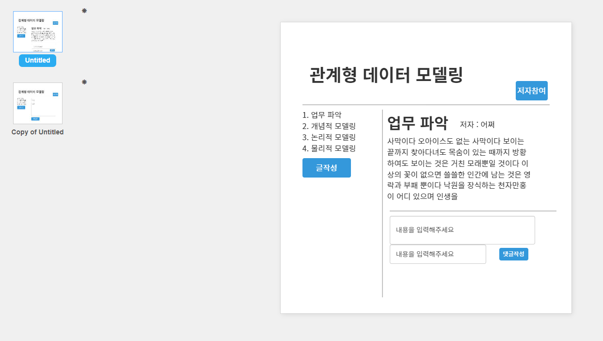

  ## 개념적 데이터 모델링
  - 우리가 파악한 업무에서 데이터를 뽑아내는 과정
  - 현실에서 우리에게 필요한 것을 제공해주는 필터, 타인과 대화하는 언어로 기능한다

 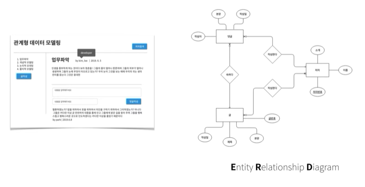
- ERD
  - 정보를 발견하고 표현하는 것
  - 서로 연관정보를 그룹핑하고 표현하는 것
  - 정보 그룹사이의 관게를 인식하고 표현하는것

### ERD의 구성요소
 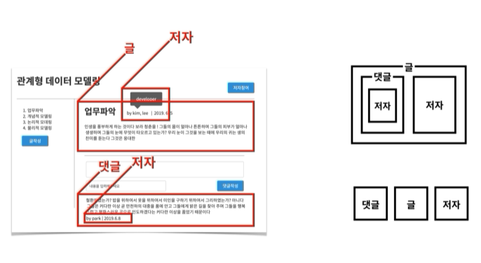

 - 정보를 표현하는데 정답은 없다
   - 알아보기 쉽게, 설명하기 쉽게 표현하면 된다.
 - 관계형 데이터 베이스는 내포관계를 허용하지 않는다
 - 거대 단일 테이블로 표현하면 중복이 발생할 수 있다.

 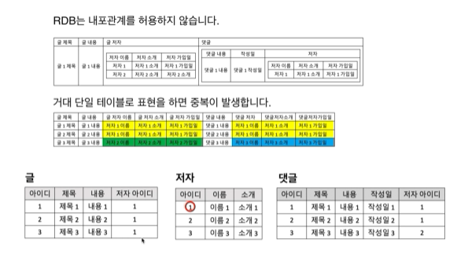
 - 때문에 해당 그림처럼 글/저자/댓글처럼 나눠서 표현하는 방법이 효율적이다

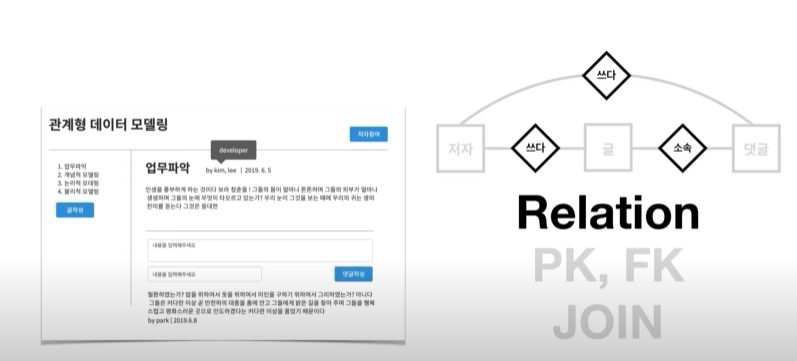
- 본문, 제목, 생성일 등이 속성(Attribute/column)이 되고 이것을 묶은 것을 '글'이라는 그룹핑 된 정보가 되는 것이다. 이것이 E(Entity)가 된다.

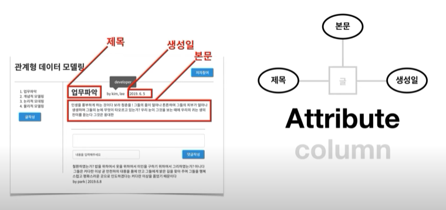
- 글과 저자, 댓글 등의 관계를 포현해주는 것이 관계(Relation)이라고 한다.

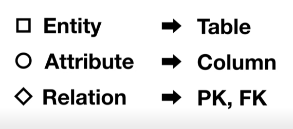
각각을 데이터베이스에 대응시켜보면 이렇게 표현된다.
- Pk는 프라이머리 키, FK는 외부 키

### 엔티티의 정의
UI와 DB는 서로 결과와 원인이라는 관계로 설명된다.

### 속성의 정의
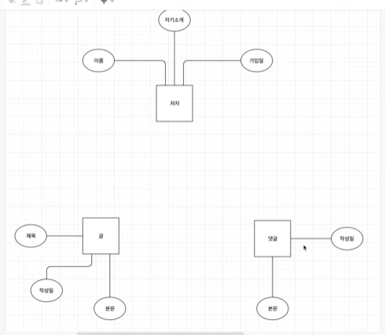
각 엔티티 별로 가지고 있는 속성을 잘 파악해서 나눠줄 필요가 있다.

### 식별자(Identifier)
-엔티티에 있는 속성 중 대표적인 속성(식별자)를 뽑아야한다.
- 식별자는 중복된 값을 가지면 안된다.
- 이것은 훗날 PK(프라이머리 키)가 된다
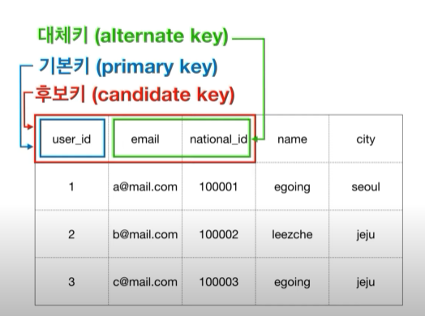
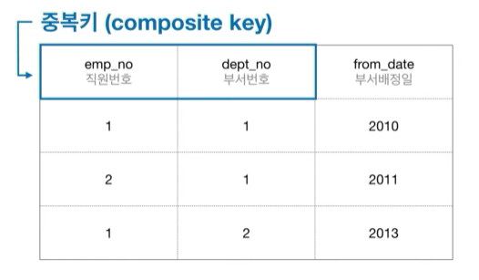
- 식별자가 없다면 인공적으로 만들어서 식별자를 부여하는것도 방법이다.
  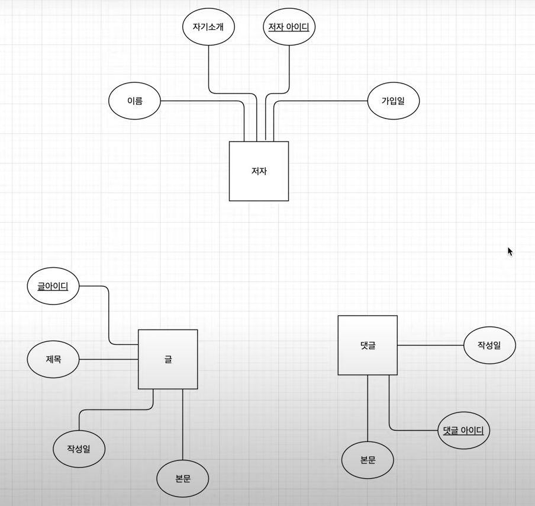

### 엔티티간의 연결
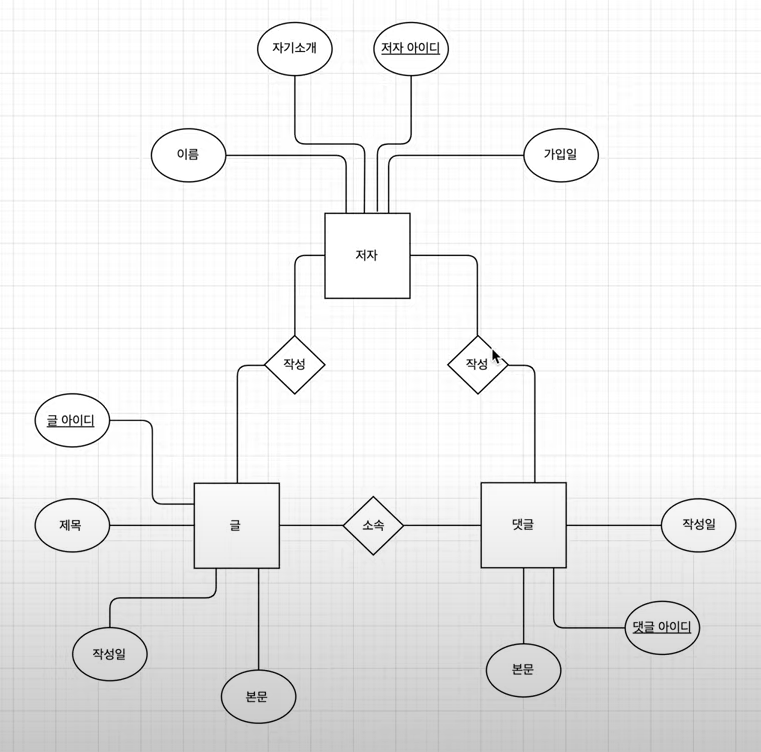
- 엔티티간의 연결은 공통되는 특징(마름모)으로 묶어 위와 같이 표현이 가능하다.
### Cardinality&Optionality
- 기수(Cardinality)
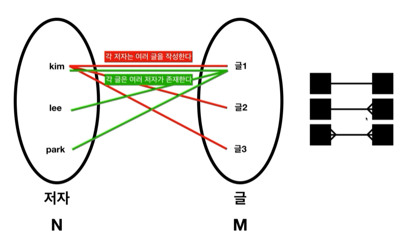
  - 1:1로 매칭되냐, 1:n으로 매칭되냐, n:n으로 매칭되냐에 따라 표현법이 달라진다
- 관계의 선택성(Optionality)
- 있을수도 있고 없을 수도 있는 항목이다.  
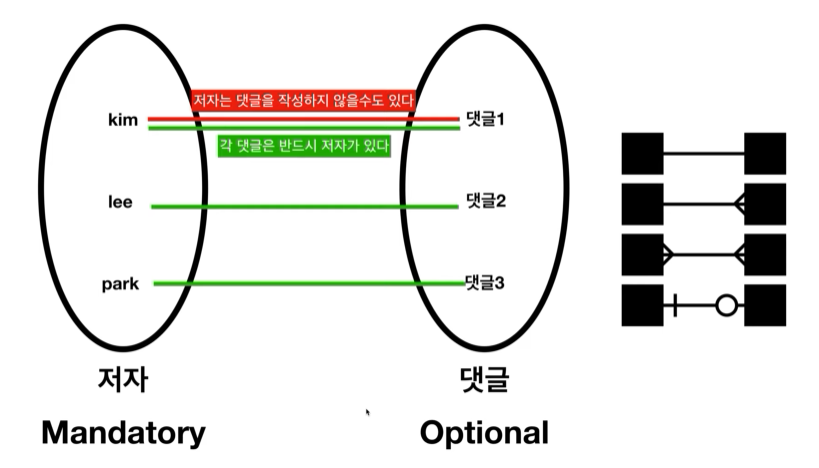

#### 부록
[관계형 데이터 모델 헬퍼](http://erd.yah.ac/)
관계형 데이터 모델 기획단계에서 참고하면 좋을 것 같다.

## 논리적 데이터 모델링
- 가장어렵고 중요한 부분.
- 개념적 모델링이 잘 되어있다면 조금 편하다.
- Mapping Rule
  - ERD를 통해 작성한 것을 관계형 데이터 베이스에 맞는 형식으로 전환하는 방법
## 정규화(Normalization)
- 정제되지 않은 표를 관계형 데이터 베이스에 어울리는 표로 만들어주는 레시피

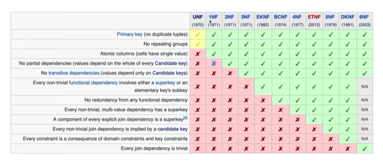

### 제1 정규화
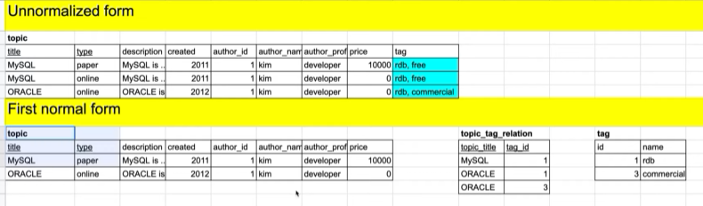
- 제1정규화의 원칙
  - Atomic columns :  
  각각의 값이 중복되지않아야한다.
  즉 중복되는 정보가 없게 표를 쪼갠다.

### 제2 정규화
- 부분종속성(No partial dependencise)이 없어야한다.
  - 중복키 인것이 없는 상태
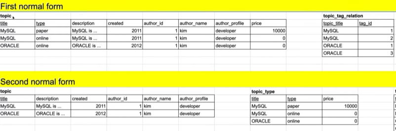

### 제3 정규화
- 이행적 종속성(No transitive dependencies)이 없어야한다
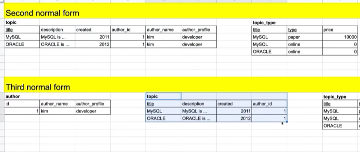

## 물리적 데이터 모델링
- 이상적인 표를 구체적인 현실적인 표로 만드는 방법
- 이 단게에서 중요한 것은 성능이다
- 우선 제작하고 나면 느린 부분, 병목현상이 일어나는 query가 있느지 찾아낸다.
  - find slow query
  - denormalization(역정규화)
  - index
    - 행에 대한 읽기성능을 비약적으로 상승시키나 쓰기 성능을 심각하게 감퇴시킨다.
  - application
    - 한번 들어온 값을 저장해놨다가(캐시에) 다음에 해당 값을 불러와야할 때 성능을 향상시키는 방법  
데이터 베이스에 걸리는 부하를 효과적으로 감소시킬수있다.

### 역정규화(denormalization)
- 쓰기의 편리함을 위해 읽기의 성능을 의생하는 방법
- 표는 읽기가 자주 발생하므로 역정규화는 최후의 방법으로 생각하는 것이 좋다.
- 방식
1. 컬럼의 역정규화 :  
컬럼(colunm) 중복, Join 줄이기  
파생 컬럼의 형성을 통해 계산작업 줄이기
2. 테이블의 역정규화 :   
컬럼을 기준으로 테이블을 불리
3. 테이블의 역정규화 :   
행을 기준으로 테이블을 분리
4. 관계의 역정규화 :  
join을 줄여 지름길을 만든다.

---
DB만들 때 참고할 자료