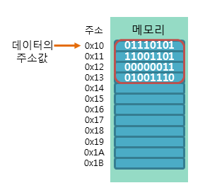
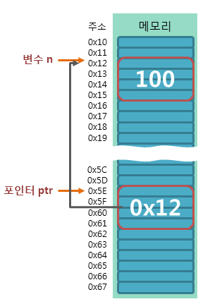
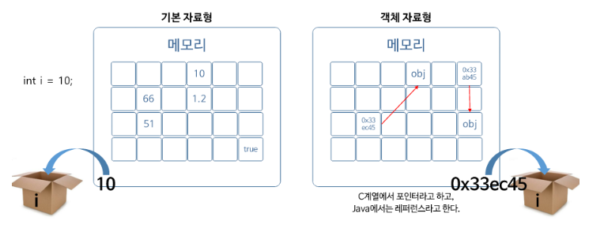
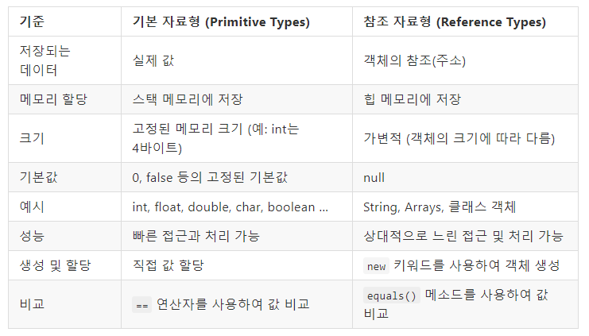

# 변수
- 변수란 데이터를 저장할 수 있는 메모리 공간에 붙인 이름이다
- 변수를 선언하면 시스템은 변수의 데이터 유형에 따라 메모리에 특정 바이트 수를 할당한다
- 자바에서는 기본 자료형(Primitive Types) 과 참조 자료형(Reference Types) 두 가지 유형의 변수를 사용할 수 있다

## 변수와 메모리
- 메모리는 작업 처리에 필요한 데이터와 명령을 저장하는 저장 시스템이다
- 메모리는 바이트 단위로 구성되며, 각 바이트는 각각 고유한 주소를 가진다  


## 기본 자료형(Primitive Types)


- 변수에 데이터를 직접 저장하는 자료형을 의미한다
- int a;
  - 변수의 선언
  - 이 과정에서 컴퓨터는 변수의 크기에 맞는 메모리 공간을 할당한다
    - int 형 변수이므로 4바이트의 공간을 할당한다
    - 자바는 기본적으로 할당과 동시에 0으로 초기화한다
- a = 10
  - 변수의 초기화
  - 변수에 값을 할당하는 것을 의미한다
  - 변수 a의 주소에 10이라는 값을 저장한다

### 형변환
- 형변환이란 값의 타입을 다른 타입으로 변환하는 것을 의미한다
  - boolean을 제외한 7개의 기본형은 서로 형변환이 가능하다
- 형변환 형식 : ([자료형])[변수명]
  - (char)65 : 'A'
  - (int)A' : 65
  - (int)1.6f : 1

- 형변환 시 범위가 작은 값에서 범위카 큰 값으로 변환할 때 현변환 생략 가능하다
  - 범위가 큰 값에서 범위가 작은 값으로 형변환을 할 때 현변환을 생략할 수 없다
    - 형변환을 생략하면 데이터의 손실이 발생할 수 있기 때문

## 참조 자료형 (Reference Types)

- 변수에 데이터를 저장하는 것이 아니라 메모리 주소를 저장할 수도 있다. 이를 포인터(pointer) 또는 참조(reference)라고 한다
- 자바에서 참조를 사용한 변수는 참조 자료형이라고 한다
  - 참조 자료형은 객체의 주소를 저장하고, 객체의 주소를 통해 객체를 참조할 수 있다
- 포인터와 참조 모두 메모리 주소를 통해 데이터를 간접적으로 접근한다. 하지만 포인터는 메모리를 직접 핸들링할 수 있지만 참조는 메모리를 직접 핸들링할 수 없다는 차이점이 존재한다
  - 자바에서는 포인터를 직접 사용할 수 없지만, 참조 변수를 사용하여 메모리 주소를 저장함으로써 포인터와 유사한 작업을 수행할 수 있다

## 기본 자료형 (Primitive Types)과 참조 자료형 (Reference Types) 비교


- 기본 자료형 : 데이터가 변수에 직접 저장되는 자료형
- 참조 자료형 : 메모리 주소가 변수에 저장되는 자료형
  

## 변수의 스코프
- 스코프란 변수가 유효한 범위를 의미한다
- 스코프는 중괄호 {}로 결정되며 변수는 선언된 위치에 따라 스코프가 달라지게 된다
  - 중괄호 내에서 선언된 변수는 중괄호 내에서만 유효하다
```java
public class Main {
    public static void main(String[] args) {
        int a = 10; // main 메소드 내에서 선언된 변수 a
        System.out.println(a); // 10
        {
            int b = 20; // 중괄호 내에서 선언된 변수 b
            System.out.println(a); // 10
            System.out.println(b); // 20
        }
        System.out.println(a); // 10
        System.out.println(b); // 에러 발생
    }
}
```